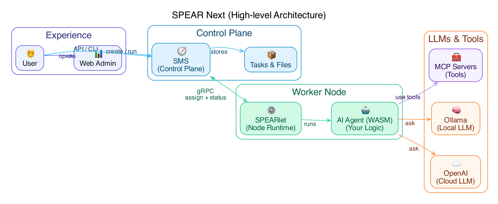

# SPEAR Next

SPEAR Next is the Rust/async implementation of SPEAR’s core services:

- **SMS**: the metadata/control-plane server.
- **SPEARlet**: the node-side agent/runtime.

Chinese README: [README.zh.md](./README.zh.md)

## Repository layout

- `src/apps/sms`: SMS binary entrypoint
- `src/apps/spearlet`: SPEARlet binary entrypoint
- `web-admin/`: Web Admin frontend source
- `assets/admin/`: built Web Admin static assets embedded/served by SMS
- `samples/wasm-c/`: C-based WASM samples (WASI)
- `docs/`: design notes and usage guides

## Architecture



## Quick start

### Prerequisites

- Rust toolchain (latest stable recommended)

This repo uses `protoc-bin-vendored`, so you typically don’t need to install `protoc` manually.

### Build

```bash
make build

# release
make build-release

# build with Rust features (e.g. sled / rocksdb)
make FEATURES=sled build

# enable local microphone capture implementation (optional)
make FEATURES=mic-device build

# macOS shortcut (equivalent to FEATURES+=mic-device)
make mac-build
```

### Run SMS

```bash
./target/debug/sms

# enable Web Admin
./target/debug/sms --enable-web-admin --web-admin-addr 127.0.0.1:8081
```

Useful endpoints:

- HTTP gateway: `http://127.0.0.1:8080`
- Swagger UI: `http://127.0.0.1:8080/swagger-ui/`
- OpenAPI spec: `http://127.0.0.1:8080/api/openapi.json`
- gRPC: `127.0.0.1:50051`
- Web Admin (when enabled): `http://127.0.0.1:8081/admin`

### Run SPEARlet

SPEARlet connects to SMS once you provide `--sms-grpc-addr` (then it auto-registers by default).

```bash
./target/debug/spearlet --sms-grpc-addr 127.0.0.1:50051
```

## Configuration

### Config file locations

- SMS: `~/.sms/config.toml` (or `--config <path>`)
- SPEARlet: `~/.spear/config.toml` (or `--config <path>`)

Repo-shipped examples:

- SMS: `config/sms/config.toml`
- SPEARlet: `config/spearlet/config.toml`

### Priority

1. CLI `--config` file
2. Home config (`~/.sms/config.toml` or `~/.spear/config.toml`)
3. Environment variables (`SMS_*`, `SPEARLET_*`)
4. Built-in defaults

### Secrets

Do not put secrets into config files. Use `llm.credentials[].api_key_env` to reference environment variables.

### Ollama discovery

SPEARlet can import models from a local Ollama on startup and materialize them as LLM backends.

- Docs: `docs/ollama-discovery-en.md`

## Routing and debugging

- **Route by model**: if some backends are configured with `model = "..."`, requests can be routed by setting only `model` (no explicit `backend` required).
- **Observe the selected backend**:
  - `cchat_recv` JSON includes a top-level `_spear.backend` / `_spear.model`.
  - Router emits a `router selected backend` debug log after selection.

## Web Admin

Web Admin provides Nodes/Tasks/Files/Backends pages.

- Backends supports an aggregated view across nodes.
- Clicking a backend row opens a detail dialog with Raw JSON.

Docs:

- `docs/web-admin-overview-en.md`
- `docs/web-admin-ui-guide-en.md`

## WASM samples

```bash
make samples
```

Artifacts are written to `samples/build/` (C) and `samples/build/js/` (WASM-JS, compat: `samples/build/rust/`).

Docs:

- `docs/samples-build-guide-en.md`

## Development

```bash
make help
make dev
make ci
```

UI tests (Playwright):

```bash
make test-ui
```

## Documentation

- `docs/INDEX.md`

## License

Apache-2.0. See `LICENSE`.
