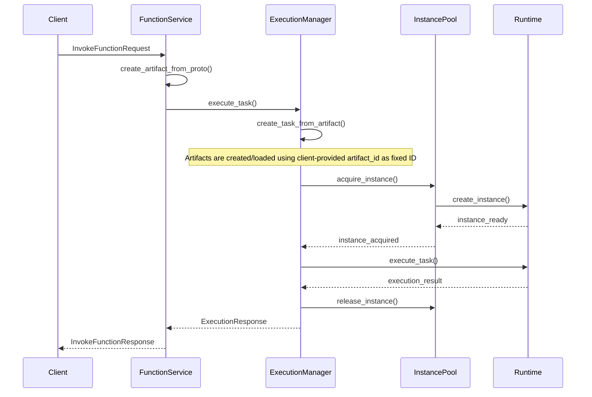

# Artifact-Task-Instance Architecture Overview

## Architecture Introduction / 架构简介

The Artifact-Task-Instance architecture is the core architectural pattern for function execution in the Spear-Next project. This architecture decomposes the function execution process into three core concepts:

- **Artifact (制品)**: Executable code packages containing runtime configuration and metadata
- **Task (任务)**: Execution units created from Artifacts, representing specific execution requests
- **Instance (实例)**: Runtime environment instances responsible for actual Task execution

## Core Components / 核心组件

### 1. Artifact Management / 制品管理

```
src/spearlet/execution/artifact.rs
├── ArtifactSpec          # Artifact specification definition
├── Artifact              # Artifact entity
├── ArtifactManager       # Artifact manager
└── ArtifactStatus        # Artifact status
```

**Key Features**:
- Artifact creation, storage, and version management
- Runtime configuration and environment variable management
- Artifact dependency handling
- Artifact lifecycle management

### 2. Task Management / 任务管理

```
src/spearlet/execution/task.rs
├── Task                  # Task entity
├── TaskSpec              # Task specification
├── TaskStatus            # Task status
└── TaskManager           # Task manager
```

**Key Features**:
- Create Tasks from Artifacts
- Task status tracking and lifecycle management
- Task parameter and context handling
- Task execution result collection

### 3. Instance Management / 实例管理

```
src/spearlet/execution/instance.rs
├── Instance              # Instance entity
├── InstanceSpec          # Instance specification
├── InstanceStatus        # Instance status
├── InstancePool          # Instance pool
└── InstanceScheduler     # Instance scheduler
```

**Key Features**:
- Runtime instance creation and destruction
- Instance pool management and load balancing
- Instance health checks and failure recovery
- Resource limits and isolation

### 4. Execution Management / 执行管理

```
src/spearlet/execution/manager.rs
├── TaskExecutionManager  # Task execution manager
├── ExecutionWorkItem     # Internal work item in the execution queue
├── ExecutionResponse     # Execution response
├── ExecutionContext      # Execution context
└── ExecutionStatistics   # Execution statistics
```

**Key Features**:
- Coordinate interactions between Artifact, Task, and Instance
- Execution flow orchestration and control
- Error handling and retry mechanisms
- Performance monitoring and statistics

### 5. Runtime Management / 运行时管理

```
src/spearlet/execution/runtime/
├── mod.rs                # Runtime module definition
├── manager.rs            # Runtime manager
├── process.rs            # Process runtime
├── kubernetes.rs         # Kubernetes runtime
└── wasm.rs               # WebAssembly runtime
```

**Key Features**:
- Multiple runtime support (process, container, WASM)
- Runtime lifecycle management
- Resource monitoring and limits
- Security isolation and sandboxing

## Architecture Flow / 架构流程

### 1. Function Invocation Flow



### 2. Instance Lifecycle

```mermaid
stateDiagram-v2
    [*] --> Creating: create_instance()
    Creating --> Ready: initialization_complete
    Ready --> Running: execute_task()
    Note over Instance: InstanceConfig carries ArtifactSnapshot injected from Artifact (location/checksum)
    Running --> Ready: task_complete
    Ready --> Terminating: shutdown()
    Running --> Terminating: force_shutdown()
    Terminating --> [*]: cleanup_complete
    
    Ready --> Failed: health_check_failed
    Running --> Failed: execution_error
    Failed --> Terminating: cleanup()
```

## Configuration Management / 配置管理

### 1. TaskExecutionManagerConfig

```rust
pub struct TaskExecutionManagerConfig {
    pub max_concurrent_tasks: usize,
    pub task_timeout_ms: u64,
    pub retry_attempts: u32,
    pub enable_metrics: bool,
}
```

### 2. InstancePoolConfig

```rust
pub struct InstancePoolConfig {
    pub min_instances: usize,
    pub max_instances: usize,
    pub idle_timeout_ms: u64,
    pub health_check_interval_ms: u64,
}
```

### 3. RuntimeConfig

```
pub struct RuntimeConfig {
    pub runtime_type: RuntimeType,
    pub settings: HashMap<String, serde_json::Value>,
    pub global_environment: HashMap<String, String>,
    pub spearlet_config: Option<SpearletConfig>,
    pub resource_pool: ResourcePoolConfig,
}
```

Runtimes read full node configuration via `spearlet_config` (e.g., `sms_grpc_addr`), avoiding environment variable reads in runtime code.

## Error Handling / 错误处理

### Error Type Hierarchy

```rust
pub enum ExecutionError {
    // Artifact related errors
    ArtifactError(ArtifactError),
    
    // Task related errors
    TaskError(TaskError),
    
    // Instance related errors
    InstanceError(InstanceError),
    
    // Runtime related errors
    RuntimeError(RuntimeError),
    
    // Configuration errors
    ConfigurationError(String),
    
    // System errors
    SystemError(String),
}
```

### Error Recovery Strategies

1. **Retry Mechanism**: Automatic retry for transient errors
2. **Degraded Service**: Provide degraded service when partial components fail
3. **Failure Isolation**: Prevent single instance failures from affecting the entire system
4. **Fail Fast**: Quick return for unrecoverable errors

## Performance Optimizations / 性能优化

### 1. Instance Pool Optimization

- **Warm-up Strategy**: Pre-create hot instances to reduce cold start time
- **Load Balancing**: Smart scheduling algorithms to optimize resource utilization
- **Elastic Scaling**: Dynamically adjust instance count based on load

### 2. Memory Management

- **Zero Copy**: Avoid data copying when possible
- **Object Pooling**: Reuse frequently created objects
- **Smart Caching**: Cache hot data and computation results

### 3. Concurrency Optimization

- **Asynchronous Execution**: Fully asynchronous architecture improves concurrency
- **Lock Optimization**: Use read-write locks and lock-free data structures
- **Batch Processing**: Process similar requests in batches

## Monitoring and Observability / 监控和观测

### 1. Metrics Collection

```rust
pub struct ExecutionMetrics {
    pub total_executions: u64,
    pub successful_executions: u64,
    pub failed_executions: u64,
    pub average_execution_time_ms: f64,
    pub active_instances: usize,
    pub queue_length: usize,
}
```

### 2. Logging

- **Structured Logging**: Use tracing library for structured logging
- **Hierarchical Logging**: Support different log levels
- **Context Propagation**: Propagate tracing context throughout the execution chain

### 3. Health Checks

- **Component Health**: Check health status of each component
- **Resource Monitoring**: Monitor CPU, memory, network resource usage
- **Performance Metrics**: Collect and report performance-related metrics

## Scalability Design / 扩展性设计

### 1. Horizontal Scaling

- **Distributed Instance Pool**: Support cross-node instance management
- **Load Sharding**: Intelligent sharding based on load characteristics
- **Service Discovery**: Automatic service instance discovery and registration

### 2. Vertical Scaling

- **Dynamic Resource Adjustment**: Dynamically adjust resource configuration based on load
- **Priority Queues**: Support task scheduling with different priorities
- **Resource Reservation**: Reserve dedicated resources for important tasks

## Security Considerations / 安全性考虑

### 1. Isolation Mechanisms

- **Process Isolation**: Different tasks run in separate processes
- **Container Isolation**: Use container technology for stronger isolation
- **Resource Limits**: Limit resource usage for each task

### 2. Access Control

- **Authentication**: Verify caller identity
- **Authorization**: Role-based access control
- **Audit Logging**: Record all security-related operations

## Future Development / 未来发展

### 1. Short-term Goals

- Improve error handling and recovery mechanisms
- Optimize performance and resource utilization
- Enhance monitoring and observability capabilities

### 2. Medium-term Goals

- Support more runtime types
- Implement distributed execution capabilities
- Add advanced scheduling strategies

### 3. Long-term Goals

- Support Serverless computing model
- Implement intelligent resource management
- Provide graphical management interface

## Summary / 总结

The Artifact-Task-Instance architecture provides Spear-Next with a flexible, scalable, high-performance function execution framework. Through clear separation of responsibilities and modular design, this architecture can support multiple runtime environments, provide powerful monitoring and management capabilities, and establish a solid foundation for future feature extensions.
