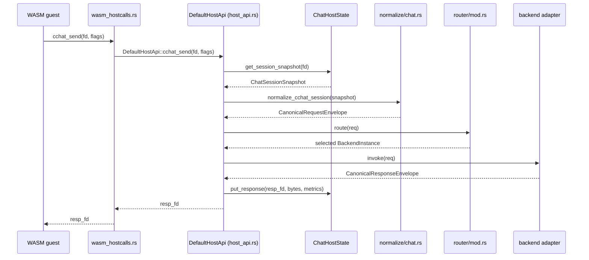
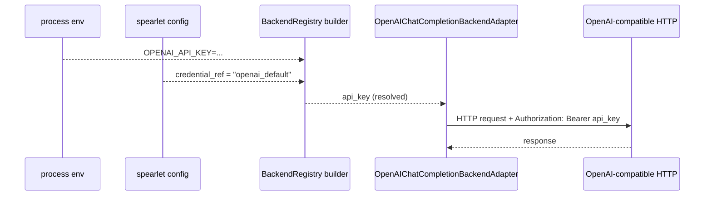

# Backend Adapter Layer Implementation Plan (File/Function Level)

This plan targets the current Rust codebase and upgrades `cchat_send` from a stub response to a real pipeline:

`ChatSession -> Normalize -> CanonicalRequestEnvelope -> Router -> BackendAdapter -> CanonicalResponseEnvelope -> write response_fd`

It also keeps the same shape reusable for future `emb/img/asr/tts/rt` operations.

## Diagrams

### 1) End-to-end data flow (cchat)

```mermaid
flowchart LR
  wasm[WASM guest]
  hostcalls[WASM hostcalls ABI\nwasm_hostcalls.rs]
  hostapi[DefaultHostApi\nhost_api.rs]
  state[ChatHostState\n(host_api.rs)]
  norm[Normalize\nai/normalize/chat.rs]
  ir[CanonicalRequestEnvelope\nai/ir.rs]
  router[Router\nai/router/mod.rs]
  backend[BackendAdapter\nai/backends/*]
  resp[CanonicalResponseEnvelope\nai/ir.rs]
  store[store response_fd\nhost_api.rs]

  wasm --> hostcalls --> hostapi --> state
  state --> norm --> ir --> router --> backend --> resp --> store --> wasm
```

### 2) Sequence (cchat_send)



### 3) Router selection (filters + policy)

```mermaid
flowchart TD
  req[CanonicalRequestEnvelope]
  idx[BackendRegistry]
  f1[filter: required_ops]
  f2[filter: required_features]
  f3[filter: required_transports]
  f4[filter: allowlist/denylist]
  pol[apply policy\n(weighted_random/rr/...)]
  sel[BackendInstance]
  err[NoCandidateBackend]

  req --> idx --> f1 --> f2 --> f3 --> f4 --> pol
  pol --> sel
  f4 -->|empty| err
```

### 4) Secrets (API key) injection and usage



### 5) Optional discovery (external observability, not used for in-process routing)

```mermaid
flowchart LR
  user[Ops/UI]
  http[HTTP gateway\nhttp_gateway.rs]
  view[registry view\n(read-only snapshot)]
  reg[BackendRegistry\n(in-process)]

  user -->|GET /api/v1/backends| http --> view --> reg
  user -->|GET /api/v1/capabilities| http --> view --> reg
```

## 0. Current anchors (stable entrypoints)

- WASM hostcall ABI entrypoint: `src/spearlet/execution/runtime/wasm_hostcalls.rs`
  - hostcall `cchat_send` calls `DefaultHostApi::cchat_send` (`wasm_hostcalls.rs:~250+`)
- Host-side chat state and stub response: `src/spearlet/execution/host_api.rs`
  - `DefaultHostApi::cchat_send` currently builds an OpenAI-shaped JSON and stores it as the response (`host_api.rs:84-151`)
  - chat session state `ChatSession` is currently private to `host_api.rs` (`host_api.rs:170-175`)

## 1. Module layout (recommended under `src/spearlet/execution/ai/`)

Add a new module subtree without disrupting existing `execution/*`:

```text
src/spearlet/execution/
  ai/
    mod.rs
    ir.rs
    media_ref.rs
    normalize/
      mod.rs
      chat.rs
    router/
      mod.rs
      policy.rs
      registry.rs
      capabilities.rs
    backends/
      mod.rs
      stub.rs
      openai_chat_completion.rs
```

And add `pub mod ai;` to `src/spearlet/execution/mod.rs`.

## 2. Phase 1: Canonical IR types and minimal validation

### 2.1 IR type definitions

- File: `src/spearlet/execution/ai/ir.rs`
  - `enum Operation { ChatCompletions, Embeddings, ImageGeneration, SpeechToText, TextToSpeech, RealtimeVoice }`
  - `struct CanonicalRequestEnvelope { version, request_id, task_id, operation, meta, routing, requirements, policy, timeout_ms, payload, extra }`
  - `enum Payload { ChatCompletions(ChatCompletionsPayload), ... }`
  - `struct CanonicalResponseEnvelope { version, request_id, operation, backend, result, raw }`
  - `enum ResultPayload { Payload(Value), Error(CanonicalError) }` (MVP can use `serde_json::Value` for response payloads)
  - `struct CanonicalError { code, message, retryable, operation, ... }`

### 2.2 MediaRef types

- File: `src/spearlet/execution/ai/media_ref.rs`
  - `enum MediaRef { InlineBase64{mime,data}, SmsFile{mime,uri}, HttpUrl{mime,url} }`
  - Phase 1 is type-only; object storage integration comes later.

### 2.3 Minimal validation

- File: `src/spearlet/execution/ai/ir.rs`
  - `impl CanonicalRequestEnvelope { fn validate_basic(&self) -> Result<(), CanonicalError> }`
    - ensure `version` is supported
    - ensure `operation` matches `payload`
    - basic consistency for allowlist/denylist hints

## 3. Phase 2: Normalize (ChatSession -> CanonicalRequestEnvelope)

### 3.1 Make ChatSession data accessible to normalize

`ChatSession` is private to `host_api.rs` today. Two options:

- Option A (minimal change): add a read-only snapshot type and getter
  - File: `src/spearlet/execution/host_api.rs`
  - Add: `pub struct ChatSessionSnapshot { messages, tools, params }`
  - Add: `impl ChatHostState { fn get_session_snapshot(&self, fd: i32) -> Result<ChatSessionSnapshot, i32> }`
  - Update `DefaultHostApi::cchat_send` (`host_api.rs:84-151`) to use the snapshot

- Option B (cleaner): move chat state out into a dedicated file
  - File: `src/spearlet/execution/hostcall/chat_state.rs`
  - Move `ChatSession/ChatHostState/ChatResponse` and import from `host_api.rs`

MVP recommendation: Option A.

### 3.2 Implement chat normalization

- File: `src/spearlet/execution/ai/normalize/chat.rs`
  - `pub fn normalize_cchat_session(snapshot: &ChatSessionSnapshot) -> CanonicalRequestEnvelope`
    - `operation = Operation::ChatCompletions`
    - `payload = Payload::ChatCompletions(ChatCompletionsPayload{ model, messages, tools, generation, response_format })`
    - extract routing hints from `params`: `backend`, allowlist/denylist, policy override (host-constrained in Phase 3)
    - set requirements:
      - tools present => require `supports_tools`
      - `response_format=json_schema` => require `supports_json_schema`

### 3.3 Unit tests

- File: `src/spearlet/execution/ai/normalize/chat_test.rs` (or `#[cfg(test)]` inside `chat.rs`)
  - cover default model, tools->features, params->routing

## 4. Phase 3: Router/Registry/Policy (single backend + simple policy)

### 4.1 Capabilities and policies

- File: `src/spearlet/execution/ai/router/capabilities.rs`
  - `struct Capabilities { ops, features, transports, limits }`
- File: `src/spearlet/execution/ai/router/policy.rs`
  - `enum SelectionPolicy { WeightedRandom, RoundRobin, PriorityFallback }` (implement `WeightedRandom` first)

### 4.2 BackendAdapter trait

- File: `src/spearlet/execution/ai/backends/mod.rs`
  - `trait BackendAdapter { fn name(&self) -> &str; fn capabilities(&self) -> Capabilities; fn invoke(&self, req: &CanonicalRequestEnvelope) -> Result<CanonicalResponseEnvelope, CanonicalError>; }`
  - MVP uses sync `invoke`, optionally wrapping async reqwest with `tokio::runtime::Runtime::new().block_on(...)`.

### 4.3 Registry and router

- File: `src/spearlet/execution/ai/router/registry.rs`
  - `struct BackendInstance { name, weight, priority, adapter: Box<dyn BackendAdapter> }`
  - `struct BackendRegistry { instances: Vec<BackendInstance> }`
  - `impl BackendRegistry { fn candidates(&self, req: &CanonicalRequestEnvelope) -> Vec<&BackendInstance> }`

- File: `src/spearlet/execution/ai/router/mod.rs`
  - `struct Router { registry: BackendRegistry, default_policy_by_op: ... }`
  - `impl Router { fn route(&self, req: &CanonicalRequestEnvelope) -> Result<&BackendInstance, CanonicalError> }`
    - filter by required ops/features/transports
    - apply allowlist/denylist
    - select one candidate via policy (WeightedRandom)

### 4.4 Stub backend (end-to-end)

- File: `src/spearlet/execution/ai/backends/stub.rs`
  - `struct StubBackendAdapter`
  - `invoke` returns an OpenAI-shaped chat completion (move the current stub logic from `host_api.rs` into this adapter)

### 4.5 Integration: replace `DefaultHostApi::cchat_send`

- File: `src/spearlet/execution/host_api.rs`
  - Update `DefaultHostApi::cchat_send` (`host_api.rs:84-151`):
    - `snapshot = st.get_session_snapshot(fd)`
    - `req = normalize_cchat_session(&snapshot)`
    - `req.validate_basic()`
    - `backend = router.route(&req)`
    - `resp = backend.adapter.invoke(&req)`
    - serialize `resp` and `st.put_response(resp_fd, bytes, metrics_bytes)`

For MVP, keep the router as a field in `DefaultHostApi` (e.g., `ai_engine: Arc<AiEngine>`) initialized in `DefaultHostApi::new`.

## 5. Phase 4: OpenAI-compatible HTTP backend (feature-gated)

### 5.1 Cargo features and module wiring

- File: `Cargo.toml`
  - add feature `backend-openai` (and later `backend-azure-openai`, etc.)
- File: `src/spearlet/execution/ai/backends/mod.rs`
  - `#[cfg(feature = "backend-openai")] pub mod openai_chat_completion;`
### 5.2 OpenAI adapter implementation

- File: `src/spearlet/execution/ai/backends/openai_chat_completion.rs`
  - `struct OpenAIChatCompletionBackendAdapter { name, base_url, api_key }`
  - `fn invoke(&self, req: &CanonicalRequestEnvelope) -> Result<CanonicalResponseEnvelope, CanonicalError>`
    - map payload to OpenAI `POST {base_url}/chat/completions`
    - the registry resolves `credential_ref` to env name and reads the key from `RuntimeConfig.global_environment`, then passes `api_key` into the adapter
    - if missing, return a structured error (e.g., `InvalidConfiguration`) and ensure the key is never logged or returned
    - return body as `raw` and optionally extract canonical fields (MVP can pass-through)

### 5.3 Config integration

- File: `src/spearlet/config.rs`
  - add `llm: LlmConfig` to `SpearletConfig` (`#[serde(default)]`)
  - `struct LlmConfig { backends: Vec<BackendConfig>, default_policy_by_operation: ... }`
  - `struct BackendConfig { name, kind, base_url, credential_ref, weight, priority, ops, features, transports }`
- File: `src/spearlet/execution/runtime/mod.rs`
  - `RuntimeConfig.spearlet_config` already holds a full config snapshot; use it to init the AI engine in `DefaultHostApi::new`.

## 6. Phase 5: Discovery (optional, external observability)

By default, router reads the in-process `BackendRegistry`. If external inspection is desired:

- File: `src/spearlet/http_gateway.rs`
  - add routes near router construction in `prepare()`:
    - `GET /api/v1/backends`
    - `GET /api/v1/capabilities`
  - extend `AppState` with a read-only registry view

## 7. Phase 6: SMS Web Admin Backend/Credential Reference + `HAS_ENV:*` telemetry

Goals:

- Add a “Backend/Credential Reference” page and `/admin/api/...` endpoints in SMS Web Admin to manage backend instances and `credential_ref`/`credential_refs` mappings (no plaintext key storage).
- Make spearlet heartbeat report `HAS_ENV:*` so Web Admin can show which nodes have which secret references.

### 7.1 SMS: data model and storage (no plaintext keys)

- New file: `src/sms/admin/llm_config.rs`
  - `struct BackendInstanceConfig { name, kind, base_url, credential_ref, weight, priority, ops, features, transports, extra }`
  - `struct SecretRef { name, description, tags }` (optional; MVP can derive by de-duplicating from backends)
- New file: `src/sms/admin/store.rs`
  - `struct AdminConfigStore { kv: Arc<dyn KvStore> }`
  - `fn get_backends(&self) -> Vec<BackendInstanceConfig>`
  - `fn put_backends(&self, Vec<BackendInstanceConfig>)`
  - key naming suggestion:
    - `admin:llm:backends` (single JSON) or `admin:llm:backend:<name>` (per-backend JSON)
  - validation:
    - reject any `api_key`/`secret_value` fields
    - restrict `credential_ref` to a reference name format (e.g., `[a-zA-Z0-9_-]+`)

### 7.2 SMS: Web Admin APIs (`/admin/api/llm/*`)

- File: `src/sms/web_admin.rs`
  - extend `create_admin_router(...)` with routes:
    - `GET /admin/api/llm/backends`: list backend instances (env var names only, never values)
    - `PUT /admin/api/llm/backends`: replace all (simple “Save” UX)
    - `POST /admin/api/llm/backends`: upsert one (optional)
    - `DELETE /admin/api/llm/backends/{name}`: delete one (optional)
    - `GET /admin/api/llm/secret-refs`: list secret references (derived or stored) (optional)
  - add handler functions:
    - `list_llm_backends(...)`
    - `replace_llm_backends(...)`
    - `upsert_llm_backend(...)` (optional)
    - `delete_llm_backend(...)` (optional)
  - state injection (pick one for MVP):
    - Option A: extend `GatewayState` (`src/sms/gateway.rs`) with `admin_kv: Arc<dyn KvStore>` and initialize it in `WebAdminServer::prepare_with_token`
    - Option B: introduce a dedicated `AdminState` for Web Admin (gRPC clients + kv store) to avoid impacting the SMS HTTP gateway

### 7.3 SMS: UI page (Backend/Secret Reference)

Current Web Admin UI is embedded static assets:

- `assets/admin/index.html`
- `assets/admin/react-app.js`
- `assets/admin/style.css`

MVP implementation:

- Update `assets/admin/react-app.js`:
  - add a navigation entry (e.g., `Settings` → `Backends`)
  - implement pages:
    - `BackendsPage`: editable table for backend instances (`name/kind/base_url/weight/priority/ops/features/transports/credential_ref`)
    - `CredentialsPage`: list credentials (and their env-var names) and show per-node presence
  - data flow:
    - load from `GET /admin/api/llm/backends`
    - save via `PUT /admin/api/llm/backends`
- Observability: reuse existing `GET /admin/api/nodes` response `metadata` to read `HAS_ENV:<ENV_NAME>` (no extra secret-status API needed).

Engineering note (non-MVP): move UI source into a dedicated directory (e.g., `web-admin-ui/`) and generate `assets/admin/*` via a build step rather than editing the bundle.

### 7.4 Spearlet: heartbeat reports `HAS_ENV:*`

- File: `src/spearlet/registration.rs`
  - update `send_heartbeat(...)` (`registration.rs:~281+`) to populate `HeartbeatRequest.health_info`:
    - collect `credentials[].api_key_env` that are referenced by backends via `credential_ref`
    - for each env name:
      - `health_info.insert(format!("HAS_ENV:{}", env), "true"/"false")`

### 7.5 SMS: expose `health_info` to Web Admin

SMS gRPC `heartbeat` currently ignores `HeartbeatRequest.health_info` (`src/sms/service.rs:338-362`).

MVP recommendation: merge `health_info` into node `metadata` so Web Admin `GET /admin/api/nodes` can show it without proto changes.

- File: `src/sms/service.rs`
  - update `heartbeat(...)` to merge metadata after updating heartbeat timestamp
- File: `src/sms/services/node_service.rs`
  - add `fn merge_node_metadata(&mut self, uuid: &str, kv: HashMap<String,String>)`
  - merge rules:
    - only allow `HAS_ENV:` keys (avoid polluting business metadata)
    - bound key/value lengths (prevent large heartbeat payloads)

## 8. Further expansion (Phase 7+)

- Add operations: `emb/img/asr/tts` normalization and backend branches
  - new files: `src/spearlet/execution/ai/normalize/{embeddings,image,asr,tts}.rs`
- MediaRef + object storage integration:
  - normalize converts bytes to `sms_file`
  - adapters fetch/encode to match backend protocol
- Realtime/streaming: add `src/spearlet/execution/ai/stream/` or integrate with `execution/communication`

## 9. Verification and regression

- Unit tests: normalization, policy selection, capability filtering
- Integration tests: extend WASM hostcall link tests (see `src/spearlet/execution/runtime/wasm.rs:1113+`) with a minimal WAT that exercises the full `cchat_*` path
- Build/static checks:
  - `cargo test`
  - `cargo fmt --check`
  - `cargo clippy --all-targets --all-features`
