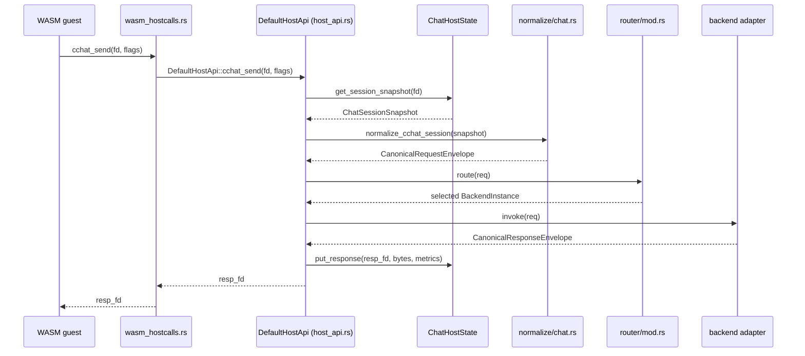
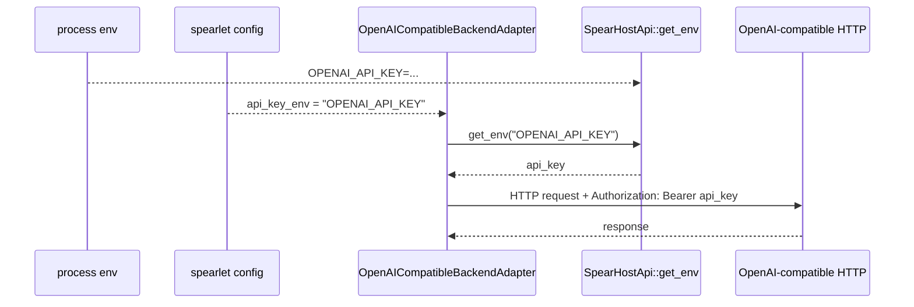

# Backend Adapter Layer 实现细节规划（文件/函数级）

本规划面向当前 Rust 代码库的落地实现，目标是把 `cchat_send` 从 stub 响应改造为：

`ChatSession -> Normalize -> CanonicalRequestEnvelope -> Router -> BackendAdapter -> CanonicalResponseEnvelope -> 写入 response_fd`

并为后续 `emb/img/asr/tts/rt` 扩展预留同样的路径。

## 图示

### 1) 端到端数据流（cchat）

```mermaid
flowchart LR
  wasm[WASM guest]
  hostcalls[WASM hostcalls ABI\nwasm_hostcalls.rs]
  hostapi[DefaultHostApi\nhost_api.rs]
  state[ChatHostState\n(host_api.rs)]
  norm[Normalize\nai/normalize/chat.rs]
  ir[CanonicalRequestEnvelope\nai/ir.rs]
  router[Router\nai/router/mod.rs]
  backend[BackendAdapter\nai/backends/*]
  resp[CanonicalResponseEnvelope\nai/ir.rs]
  store[store response_fd\nhost_api.rs]

  wasm --> hostcalls --> hostapi --> state
  state --> norm --> ir --> router --> backend --> resp --> store --> wasm
```

### 2) 调用时序（cchat_send）



### 3) Router 选择逻辑（过滤 + 策略）

```mermaid
flowchart TD
  req[CanonicalRequestEnvelope]
  idx[BackendRegistry]
  f1[filter: required_ops]
  f2[filter: required_features]
  f3[filter: required_transports]
  f4[filter: allowlist/denylist]
  pol[apply policy\n(weighted_random/rr/...)]
  sel[BackendInstance]
  err[NoCandidateBackend]

  req --> idx --> f1 --> f2 --> f3 --> f4 --> pol
  pol --> sel
  f4 -->|empty| err
```

### 4) Secret（API key）注入与使用



### 5) 可选 discovery（对外可观测，不参与进程内路由）

```mermaid
flowchart LR
  user[Ops/UI]
  http[HTTP gateway\nhttp_gateway.rs]
  view[registry view\n(read-only snapshot)]
  reg[BackendRegistry\n(in-process)]

  user -->|GET /api/v1/backends| http --> view --> reg
  user -->|GET /api/v1/capabilities| http --> view --> reg
```

## 0. 现状锚点（必须保持稳定的入口）

- WASM hostcall ABI 入口：`src/spearlet/execution/runtime/wasm_hostcalls.rs`
  - `cchat_send` hostcall 会调用 `DefaultHostApi::cchat_send`（`wasm_hostcalls.rs:~250+`）
- Host 侧 chat state 与 stub 响应：`src/spearlet/execution/host_api.rs`
  - `DefaultHostApi::cchat_send` 当前直接组装 OpenAI-shaped JSON 并写入 response（`host_api.rs:84-151`）
  - chat 会话状态 `ChatSession` 目前是 `host_api.rs` 内部结构（`host_api.rs:170-175`）

## 1. 目录与模块组织（建议落地到 `src/spearlet/execution/ai/`）

新增模块树（不影响现有 `execution/*` 逻辑）：

```text
src/spearlet/execution/
  ai/
    mod.rs
    ir.rs
    media_ref.rs
    normalize/
      mod.rs
      chat.rs
    router/
      mod.rs
      policy.rs
      registry.rs
      capabilities.rs
    backends/
      mod.rs
      stub.rs
      openai_compatible.rs
```

并在 `src/spearlet/execution/mod.rs` 增加 `pub mod ai;`。

## 2. Phase 1：Canonical IR 类型与最小校验

### 2.1 新增 IR 类型文件

- 文件：`src/spearlet/execution/ai/ir.rs`
  - `enum Operation { ChatCompletions, Embeddings, ImageGeneration, SpeechToText, TextToSpeech, RealtimeVoice }`
  - `struct CanonicalRequestEnvelope { version, request_id, task_id, operation, meta, routing, requirements, policy, timeout_ms, payload, extra }`
  - `enum Payload { ChatCompletions(ChatCompletionsPayload), ... }`
  - `struct CanonicalResponseEnvelope { version, request_id, operation, backend, result, raw }`
  - `enum ResultPayload { Payload(Value), Error(CanonicalError) }`（MVP 可先用 `serde_json::Value` 承载 response payload）
  - `struct CanonicalError { code, message, retryable, operation, ... }`

### 2.2 MediaRef 独立文件

- 文件：`src/spearlet/execution/ai/media_ref.rs`
  - `enum MediaRef { InlineBase64{mime,data}, SmsFile{mime,uri}, HttpUrl{mime,url} }`
  - 先只在类型层定义，不在 Phase 1 做对象存储联动。

### 2.3 最小校验函数

- 文件：`src/spearlet/execution/ai/ir.rs`
  - `impl CanonicalRequestEnvelope { fn validate_basic(&self) -> Result<(), CanonicalError> }`
    - 检查 `version`、`operation` 与 `payload` 是否对齐
    - 检查 allowlist/denylist 规则的基本一致性（例如 denylist 覆盖 allowlist）

## 3. Phase 2：Normalize（ChatSession -> CanonicalRequestEnvelope）

### 3.1 暴露/抽取 ChatSession 以便 normalize

当前 `ChatSession` 在 `host_api.rs` 内部不可复用。两种可选落地方式：

- 方案 A（改动小）：在 `host_api.rs` 增加一个只读快照结构体与 getter
  - 文件：`src/spearlet/execution/host_api.rs`
  - 新增：`pub struct ChatSessionSnapshot { messages, tools, params }`
  - 新增：`impl ChatHostState { fn get_session_snapshot(&self, fd: i32) -> Result<ChatSessionSnapshot, i32> }`
  - 在 `DefaultHostApi::cchat_send`（`host_api.rs:84-151`）改为获取 snapshot 而不是 clone 内部 `ChatSession`

- 方案 B（更干净）：把 chat state 从 `host_api.rs` 拆到新文件
  - 文件：`src/spearlet/execution/hostcall/chat_state.rs`
  - `ChatSession/ChatHostState/ChatResponse` 迁移，并在 `host_api.rs` 引用

MVP 推荐方案 A。

### 3.2 实现 normalize 函数

- 文件：`src/spearlet/execution/ai/normalize/chat.rs`
  - `pub fn normalize_cchat_session(snapshot: &ChatSessionSnapshot) -> CanonicalRequestEnvelope`
    - `operation = Operation::ChatCompletions`
    - `payload = Payload::ChatCompletions(ChatCompletionsPayload{ model, messages, tools, generation, response_format })`
    - `routing` 从 `params` 提取：`backend`、allowlist/denylist、policy override（受 host 配置约束，Phase 3 实现）
    - `requirements`：
      - 若设置了 tools，则 `required_features` 包含 `supports_tools`
      - 若 `params.response_format=json_schema`，则 `required_features` 包含 `supports_json_schema`

### 3.3 单元测试

- 文件：`src/spearlet/execution/ai/normalize/chat_test.rs`（或 `chat.rs` 内 `#[cfg(test)]`）
  - 覆盖：
    - `model` 默认值
    - tools presence → capabilities
    - params → routing hints

## 4. Phase 3：Router/Registry/Policy（先实现单后端与简单策略）

### 4.1 Capabilities 与 Policy 结构

- 文件：`src/spearlet/execution/ai/router/capabilities.rs`
  - `struct Capabilities { ops, features, transports, limits }`
- 文件：`src/spearlet/execution/ai/router/policy.rs`
  - `enum SelectionPolicy { WeightedRandom, RoundRobin, PriorityFallback }`（先实现 `WeightedRandom`）

### 4.2 BackendAdapter trait

- 文件：`src/spearlet/execution/ai/backends/mod.rs`
  - `trait BackendAdapter { fn name(&self) -> &str; fn capabilities(&self) -> Capabilities; fn invoke(&self, req: &CanonicalRequestEnvelope) -> Result<CanonicalResponseEnvelope, CanonicalError>; }`
  - MVP 先用同步 `invoke`，内部可以用 `tokio::runtime::Runtime::new().block_on(...)` 调用 async reqwest（后续再优化为共享 runtime）。

### 4.3 Registry 与 Router

- 文件：`src/spearlet/execution/ai/router/registry.rs`
  - `struct BackendInstance { name, weight, priority, adapter: Box<dyn BackendAdapter> }`
  - `struct BackendRegistry { instances: Vec<BackendInstance> }`
  - `impl BackendRegistry { fn candidates(&self, req: &CanonicalRequestEnvelope) -> Vec<&BackendInstance> }`

- 文件：`src/spearlet/execution/ai/router/mod.rs`
  - `struct Router { registry: BackendRegistry, default_policy_by_op: ... }`
  - `impl Router { fn route(&self, req: &CanonicalRequestEnvelope) -> Result<&BackendInstance, CanonicalError> }`
    - 过滤 required ops/features/transports
    - 应用 allowlist/denylist
    - 用 policy 选一个实例（`WeightedRandom`）

### 4.4 Stub backend（闭环）

- 文件：`src/spearlet/execution/ai/backends/stub.rs`
  - `struct StubBackendAdapter`
  - `invoke` 返回一个 OpenAI-shaped chat completion（复用当前 `host_api.rs` 中 stub 逻辑，迁移到这里）

### 4.5 集成点：替换 `DefaultHostApi::cchat_send`

- 文件：`src/spearlet/execution/host_api.rs`
  - 修改 `DefaultHostApi::cchat_send`（`host_api.rs:84-151`）：
    - `snapshot = st.get_session_snapshot(fd)`
    - `req = normalize_cchat_session(&snapshot)`
    - `req.validate_basic()`
    - `backend = router.route(&req)`
    - `resp = backend.adapter.invoke(&req)`
    - 将 `resp` 序列化为 bytes 并 `st.put_response(resp_fd, bytes, metrics_bytes)`

MVP 阶段 router 可以作为 `DefaultHostApi` 的一个字段（例如 `ai_engine: Arc<AiEngine>`），在 `DefaultHostApi::new` 时初始化。

## 5. Phase 4：OpenAI-compatible HTTP backend（feature-gated）

### 5.1 Cargo feature 与模块入口

- 文件：`Cargo.toml`
  - 新增 feature：`backend-openai`（以及后续 `backend-azure-openai` 等）
- 文件：`src/spearlet/execution/ai/backends/mod.rs`
  - `#[cfg(feature = "backend-openai")] pub mod openai_compatible;`

### 5.2 OpenAI backend adapter

- 文件：`src/spearlet/execution/ai/backends/openai_compatible.rs`
  - `struct OpenAICompatibleBackendAdapter { name, base_url, api_key_env, client }`
  - `fn invoke_chat_completions(&self, req: &CanonicalRequestEnvelope) -> Result<CanonicalResponseEnvelope, CanonicalError>`
    - 将 payload 映射到 OpenAI `POST {base_url}/chat/completions`
    - API key 从 `SpearHostApi::get_env(api_key_env)` 读取（当前实现从 `RuntimeConfig.global_environment` 获取，见 `src/spearlet/execution/host_api.rs:309-311`）
    - 缺失 key 时返回结构化错误（例如 `InvalidConfiguration`），并确保不会在任何日志/错误中输出 key
    - 返回 body 作为 `raw`，并提取必要字段到 canonical response（MVP 可以先直接透传）

### 5.3 配置接入

- 文件：`src/spearlet/config.rs`
  - 为 `SpearletConfig` 增加 `llm: LlmConfig`（`#[serde(default)]`）
  - `struct LlmConfig { backends: Vec<BackendConfig>, default_policy_by_operation: ... }`
  - `struct BackendConfig { name, kind, base_url, api_key_env, weight, priority, ops, features, transports }`
- 文件：`src/spearlet/execution/runtime/mod.rs`
  - `RuntimeConfig.spearlet_config` 已包含全量配置快照，可由 `DefaultHostApi::new` 注入到 ai_engine 初始化

## 6. Phase 5：Discovery（可选，对外可观测）

默认情况下 router 直接读进程内 `BackendRegistry`。如需对外暴露观测接口：

- 文件：`src/spearlet/http_gateway.rs`
  - 在 `prepare()` 的 router 构建处增加：
    - `GET /api/v1/backends`：列出实例、capabilities、健康状态（MVP 可先不做健康）
    - `GET /api/v1/capabilities`：按 operation 聚合输出
  - 需要在 `AppState` 增加 `ai_registry_view: ...`（只读快照）

## 7. Phase 6：SMS Web Admin Backend/Secret Reference + `HAS_ENV:*` 可观测

目标：

- 在 SMS Web Admin 增加“Backend/Secret Reference”页面与 `/admin/api/...` 管理接口，用于维护 backend instance 与 `api_key_env`/`api_key_envs` 的映射（不保存明文 key）。
- 让 spearlet 心跳上报 `HAS_ENV:*`，以便 Web Admin 能展示“某个节点是否具备某个 secret 引用”。

### 7.1 SMS：数据模型与存储（不落明文 key）

- 新增文件：`src/sms/admin/llm_config.rs`
  - `struct BackendInstanceConfig { name, kind, base_url, api_key_env, weight, priority, ops, features, transports, extra }`
  - `struct SecretRef { name, description, tags }`（可选；MVP 可从 backends 去重生成）
- 新增文件：`src/sms/admin/store.rs`
  - `struct AdminConfigStore { kv: Arc<dyn KvStore> }`
  - `fn get_backends(&self) -> Vec<BackendInstanceConfig>`
  - `fn put_backends(&self, Vec<BackendInstanceConfig>)`
  - key 命名建议：
    - `admin:llm:backends`（整体 JSON）或 `admin:llm:backend:<name>`（单条 JSON）
  - 校验：
    - 禁止出现 `api_key`/`secret_value` 等字段
    - 限制 `api_key_env` 只能是 env 名称（例如 `[A-Z0-9_]+`）

### 7.2 SMS：Web Admin API（/admin/api/llm/*）

- 文件：`src/sms/web_admin.rs`
  - 扩展 `create_admin_router(...)` 新增路由：
    - `GET /admin/api/llm/backends`：返回 backend instance 列表（含 `api_key_env` 名称，不含值）
    - `PUT /admin/api/llm/backends`：整体替换（便于前端一次性保存）
    - `POST /admin/api/llm/backends`：新增/更新单条（可选）
    - `DELETE /admin/api/llm/backends/{name}`：删除单条（可选）
    - `GET /admin/api/llm/secret-refs`：返回所有引用（从 backends 聚合或独立存储）（可选）
  - 新增 handler 函数：
    - `list_llm_backends(...)`
    - `replace_llm_backends(...)`
    - `upsert_llm_backend(...)`（可选）
    - `delete_llm_backend(...)`（可选）
  - 状态注入方式（MVP 选择其一）：
    - 方案 A：扩展 `GatewayState`（`src/sms/gateway.rs`）增加 `admin_kv: Arc<dyn KvStore>`，由 `WebAdminServer::prepare_with_token` 初始化并传入
    - 方案 B：为 Web Admin 单独定义 `AdminState`（包含 gRPC clients + kv store），避免影响 SMS HTTP gateway

### 7.3 SMS：前端页面（Backend/Secret Reference）

当前 Web Admin UI 以静态资源形式内嵌：

- `assets/admin/index.html`
- `assets/admin/react-app.js`
- `assets/admin/style.css`

实现落地（MVP）：

- 修改 `assets/admin/react-app.js`：
  - 增加导航入口（例如 `Settings` 下新增 `Backends`）
  - 新增页面组件：
    - `BackendsPage`：表格编辑 backend instance（`name/kind/base_url/weight/priority/ops/features/transports/api_key_env`）
    - `SecretRefsPage`：展示所有 `api_key_env` 引用及“节点具备情况”
  - 数据获取：
    - 从 `GET /admin/api/llm/backends` 拉配置
    - 保存时调用 `PUT /admin/api/llm/backends`
- 可观测联动：复用现有 `GET /admin/api/nodes` 返回的 `metadata` 字段，读取 `HAS_ENV:<ENV_NAME>` 值进行展示（无需额外 secret API）。

工程化建议（非 MVP）：把前端源码迁移到独立目录（例如 `web-admin-ui/`），由构建脚本产出 `assets/admin/*`，避免直接维护 bundle。

### 7.4 Spearlet：心跳上报 `HAS_ENV:*`

- 文件：`src/spearlet/registration.rs`
  - 修改 `send_heartbeat(...)`（`registration.rs:~281+`）填充 `HeartbeatRequest.health_info`：
    - 从 `SpearletConfig` 的 LLM backend 配置收集所有 `api_key_env`（或 `api_key_envs`）
    - 对每个 env 名称：
      - `health_info.insert(format!("HAS_ENV:{}", env), "true"/"false")`

### 7.5 SMS：把 `health_info` 透出给 Web Admin

当前 SMS gRPC `heartbeat` 会忽略 `HeartbeatRequest.health_info`（`src/sms/service.rs:338-362`）。

MVP 推荐：在 SMS 服务侧把 `health_info` 合并进 node `metadata`，这样 Web Admin 的 `GET /admin/api/nodes` 就能直接拿到。

- 文件：`src/sms/service.rs`
  - 修改 `heartbeat(...)`：在更新心跳时间后，调用新方法合并 metadata
- 文件：`src/sms/services/node_service.rs`
  - 新增 `fn merge_node_metadata(&mut self, uuid: &str, kv: HashMap<String,String>)`
  - 合并策略：
    - 仅允许写入 `HAS_ENV:` 前缀的 key（避免污染业务 metadata）
    - 限制 key/value 长度（防止心跳携带超大 payload）

## 8. 后续扩展（Phase 7+）

- 新增 operation：`emb/img/asr/tts` 的 normalize 与 adapter
  - 新文件：`src/spearlet/execution/ai/normalize/{embeddings,image,asr,tts}.rs`
  - backend adapter 增加对应 `invoke_*` 分支
- 引入 `MediaRef` 与对象存储联动：
  - Normalize 层把 hostcall bytes 转为 `sms_file`
  - adapter 层按需拉取并编码（multipart/base64）
- realtime/streaming：新增 `src/spearlet/execution/ai/stream/` 或复用现有 `execution/communication` 子系统

## 9. 验证与回归

- 单元测试：normalize、policy selection、capability filtering
- 集成测试：用 `wasm_hostcalls.rs` 的 link 测试（`src/spearlet/execution/runtime/wasm.rs:1113+`）扩展一个最小 WAT，调用 `cchat_*` 走完整链路
- 构建与静态检查：
  - `cargo test`
  - `cargo fmt --check`
  - `cargo clippy --all-targets --all-features`
