# Sync vs Async Function Invocation Mode Comparison

## Overview

This document provides a detailed explanation of the specific differences, use cases, and implementation details between synchronous (SYNC) and asynchronous (ASYNC) execution modes in the Spearlet `InvokeFunction` interface.

## Core Differences Comparison

### 1. Execution Flow Comparison

| Feature | SYNC Mode | ASYNC Mode |
|---------|-----------|------------|
| **Invocation Style** | Blocking call | Non-blocking call |
| **Return Timing** | Returns after function completion | Returns immediately with execution ID |
| **Result Retrieval** | Result included directly in response | Requires GetExecutionStatus query |
| **Connection Maintenance** | Must maintain connection until completion | Can disconnect and query later |
| **Use Cases** | Quick-executing functions | Long-running tasks |

### 2. Request Parameters Comparison

#### Synchronous Mode Request
```protobuf
InvokeFunctionRequest {
  invocation_type = INVOCATION_TYPE_EXISTING_TASK;
  execution_mode = EXECUTION_MODE_SYNC;  // 🔑 Key: Sync mode
  task_id = "existing-task-123";        // 🔑 Invoke existing task
  function_name = "quick_calculation";
  parameters = [
    { name = "input", value = "123" }
  ];
  context = {
    timeout_ms = 5000;  // 5 second timeout
    max_retries = 0;    // Sync mode typically no retries
  };
}
```

#### Asynchronous Mode Request
```protobuf
InvokeFunctionRequest {
  invocation_type = INVOCATION_TYPE_EXISTING_TASK;
  execution_mode = EXECUTION_MODE_ASYNC;  // 🔑 Key: Async mode
  task_id = "existing-task-124";         // 🔑 Invoke existing task
  function_name = "process";
  parameters = [
    { name = "dataset", value = "large_data.csv" }
  ];
  context = {
    timeout_ms = 3600000;  // 1 hour timeout
    max_retries = 3;       // Async mode supports retries
  };
}
```

### 3. Response Content Comparison

#### Synchronous Mode Response
```protobuf
InvokeFunctionResponse {
  success = true;
  message = "Function executed successfully";
  execution_id = "sync_exec_001";
  task_id = "task_123";
  instance_id = "instance_456";
  
  // 🎯 Key: Contains complete result directly
  result = {
    status = EXECUTION_STATUS_COMPLETED;
    result = {
      type_url = "type.googleapis.com/CalculationResult";
      value = /* serialized calculation result */;
    };
    execution_time_ms = 1500;
    memory_usage_mb = 10;
  };
  
  // Async-related fields are empty
  status_endpoint = "";
  estimated_completion_ms = 0;
}
```

#### Asynchronous Mode Response
```protobuf
InvokeFunctionResponse {
  success = true;
  message = "Function execution started";
  execution_id = "async_exec_002";  // 🔑 Key: For subsequent queries
  task_id = "task_124";
  instance_id = "instance_457";
  
  // 🎯 Key: Result is in initial state
  result = {
    status = EXECUTION_STATUS_PENDING;  // Pending execution
    result = null;  // No result yet
    execution_time_ms = 0;
    start_time = "2024-01-15T10:30:00Z";
  };
  
  // 🔑 Async-related information
  status_endpoint = "/api/v1/execution/async_exec_002/status";
  estimated_completion_ms = 1800000;  // Estimated 30 minutes completion
}
```

## Detailed Execution Flows

### Synchronous Mode Execution Flow


### Asynchronous Mode Execution Flow

```mermaid
sequenceDiagram
    participant Client
    participant Spearlet
    participant TaskInstance
    participant Function
    participant ExecutionManager

    Note over Client,ExecutionManager: Asynchronous Execution Flow
    
    Client->>Spearlet: InvokeFunction(ASYNC)
    Note over Spearlet: Validate request parameters
    
    Spearlet->>TaskInstance: Find existing task → Get/Create instance
    TaskInstance-->>Spearlet: Instance ready
    
    Spearlet->>ExecutionManager: Create async execution
    ExecutionManager-->>Spearlet: execution_id
    
    Spearlet-->>Client: InvokeFunctionResponse{execution_id}
    
    Note over Client: Client can do other work
    
    par Async Execution
        ExecutionManager->>Function: Invoke function
        Note over Function: Long-running execution
        Function-->>ExecutionManager: Return result
        ExecutionManager->>ExecutionManager: Store result
    and Status Polling
        loop Poll status
            Client->>Spearlet: GetExecutionStatus(execution_id)
            Spearlet->>ExecutionManager: Query status
            ExecutionManager-->>Spearlet: Current status
            Spearlet-->>Client: GetExecutionStatusResponse
        end
    end
```



## Code Implementation Examples

### Synchronous Mode Implementation Pseudocode

```rust
async fn handle_sync_invocation(
    request: &InvokeFunctionRequest
) -> Result<InvokeFunctionResponse> {
    // 1. Acquire existing task and instance
    let task = execution_manager
        .get_task_by_id(&request.task_id)
        .ok_or("TaskNotFound")?;
    let instance = execution_manager.get_or_create_instance(&task).await?;
    
    // 2. Set synchronous execution context
    let context = ExecutionContext {
        timeout_ms: request.context.timeout_ms,
        execution_mode: ExecutionMode::Sync,
        // ...
    };
    
    // 3. Execute function directly (blocking wait)
    let start_time = Instant::now();
    let execution_result = instance.invoke_function_sync(
        &request.function_name,
        &request.parameters,
        &context,
    ).await?;
    
    // 4. Construct complete response
    Ok(InvokeFunctionResponse {
        success: true,
        execution_id: generate_execution_id(),
        task_id: instance.task_id.clone(),
        instance_id: instance.instance_id.clone(),
        result: Some(ExecutionResult {
            status: ExecutionStatus::Completed,
            result: Some(execution_result),
            execution_time_ms: start_time.elapsed().as_millis() as i64,
            // ...
        }),
        // Async fields are empty
        status_endpoint: String::new(),
        estimated_completion_ms: 0,
    })
}
```

### Asynchronous Mode Implementation Pseudocode

```rust
async fn handle_async_invocation(
    request: &InvokeFunctionRequest
) -> Result<InvokeFunctionResponse> {
    // 1. Acquire existing task and instance
    let task = execution_manager
        .get_task_by_id(&request.task_id)
        .ok_or("TaskNotFound")?;
    let instance = execution_manager.get_or_create_instance(&task).await?;
    
    // 2. Create async execution
    let execution_id = generate_execution_id();
    let execution_context = ExecutionContext {
        execution_id: execution_id.clone(),
        timeout_ms: request.context.timeout_ms,
        execution_mode: ExecutionMode::Async,
        // ...
    };
    
    // 3. Start async execution (non-blocking)
    let execution_handle = tokio::spawn(async move {
        instance.invoke_function_async(
            &request.function_name,
            &request.parameters,
            &execution_context,
        ).await
    });
    
    // 4. Store execution handle
    execution_manager.store_execution(execution_id.clone(), execution_handle);
    
    // 5. Return response immediately
    Ok(InvokeFunctionResponse {
        success: true,
        execution_id: execution_id.clone(),
        task_id: instance.task_id.clone(),
        instance_id: instance.instance_id.clone(),
        result: Some(ExecutionResult {
            status: ExecutionStatus::Pending,
            result: None,  // No result yet
            start_time: current_timestamp(),
            // ...
        }),
        // Async-related information
        status_endpoint: format!("/api/v1/execution/{}/status", execution_id),
        estimated_completion_ms: estimate_completion_time(&request),
    })
}
```

## Use Case Comparison

### Synchronous Mode Use Cases

#### ✅ Recommended Usage
- **Quick computation tasks**: Execution time < 30 seconds
- **Simple data processing**: Low memory usage, CPU-intensive
- **Real-time response needs**: Immediate result required
- **Simple API calls**: Third-party service calls

#### 📝 Example Scenarios
```protobuf
// Mathematical calculation
InvokeFunction("calculate_fibonacci", SYNC) → Returns result immediately

// Text processing
InvokeFunction("extract_keywords", SYNC) → Returns keywords immediately

// Data validation
InvokeFunction("validate_email", SYNC) → Returns validation result immediately
```

### Asynchronous Mode Use Cases

#### ✅ Recommended Usage
- **Long-running tasks**: Execution time > 1 minute
- **Big data processing**: Large dataset processing
- **Machine learning training**: Model training and inference
- **File processing**: Large file upload, conversion, compression

#### 📝 Example Scenarios
```protobuf
// Big data analysis
InvokeFunction("analyze_large_dataset", ASYNC) → Returns execution_id

// AI model training
InvokeFunction("train_ml_model", ASYNC) → Returns execution_id

// Video processing
InvokeFunction("process_video", ASYNC) → Returns execution_id
```

## Error Handling Comparison

### Synchronous Mode Error Handling

```rust
// Sync mode: Errors returned directly in response
match handle_sync_invocation(request).await {
    Ok(response) => {
        if response.result.status == ExecutionStatus::Failed {
            // Handle execution failure
            handle_execution_error(&response.result.error_message);
        } else {
            // Process successful result
            process_result(&response.result.result);
        }
    },
    Err(e) => {
        // Handle invocation error
        handle_invocation_error(e);
    }
}
```

### Asynchronous Mode Error Handling

```rust
// Async mode: Need to query status for error information
let response = handle_async_invocation(request).await?;
let execution_id = response.execution_id;

// Poll status until completion or failure
loop {
    let status = get_execution_status(execution_id).await?;
    
    match status.result.status {
        ExecutionStatus::Completed => {
            process_result(&status.result.result);
            break;
        },
        ExecutionStatus::Failed => {
            handle_execution_error(&status.result.error_message);
            break;
        },
        ExecutionStatus::Running | ExecutionStatus::Pending => {
            // Continue waiting
            tokio::time::sleep(Duration::from_secs(1)).await;
        },
        _ => {
            // Handle other statuses
            handle_unexpected_status(status.result.status);
            break;
        }
    }
}
```

## Performance Considerations

### Synchronous Mode Performance Characteristics

#### Advantages
- **Low latency**: No additional state management overhead
- **Simple implementation**: Straightforward code logic
- **Resource efficiency**: No need for additional storage and query mechanisms

#### Disadvantages
- **Connection occupation**: Long-term network connection occupation
- **Timeout risk**: Prone to network timeouts
- **Concurrency limitation**: Blocking calls limit concurrency

### Asynchronous Mode Performance Characteristics

#### Advantages
- **High concurrency**: Supports large number of concurrent requests
- **Resource elasticity**: Can dynamically adjust based on load
- **Fault tolerance**: Supports retry and recovery mechanisms

#### Disadvantages
- **Complexity**: Requires state management and query mechanisms
- **Storage overhead**: Need to store execution state and results
- **Increased latency**: Requires additional query steps

## Monitoring and Observability

### Synchronous Mode Monitoring Metrics

```yaml
metrics:
  sync_invocation:
    - execution_time_histogram  # Execution time distribution
    - success_rate             # Success rate
    - timeout_rate             # Timeout rate
    - concurrent_requests      # Concurrent request count
    - memory_usage            # Memory usage
```

### Asynchronous Mode Monitoring Metrics

```yaml
metrics:
  async_invocation:
    - queue_length            # Execution queue length
    - pending_executions      # Pending execution count
    - completion_rate         # Completion rate
    - average_wait_time       # Average wait time
    - status_query_frequency  # Status query frequency
```

## Best Practice Recommendations

### Decision Tree

```
Function execution time < 30 seconds?
├── Yes → Use SYNC mode
└── No → Does function need real-time feedback?
    ├── Yes → Consider STREAM mode
    └── No → Use ASYNC mode
```

### Configuration Recommendations

#### Synchronous Mode Configuration
```toml
[sync_execution]
default_timeout_ms = 30000      # 30 second default timeout
max_concurrent_requests = 100   # Maximum concurrent requests
enable_retries = false          # Disable retries
```

#### Asynchronous Mode Configuration
```toml
[async_execution]
default_timeout_ms = 3600000    # 1 hour default timeout
max_queue_size = 1000          # Maximum queue size
status_retention_hours = 24     # Status retention 24 hours
enable_retries = true          # Enable retries
max_retries = 3                # Maximum retry count
```

## Summary

Both synchronous and asynchronous modes have their advantages. Choosing the appropriate mode is crucial for system performance and user experience:

- **Synchronous mode**: Suitable for fast, simple function calls, providing immediate response
- **Asynchronous mode**: Suitable for long-running tasks, providing better concurrency and resource utilization

In practical applications, it's recommended to choose the appropriate execution mode based on specific business requirements and performance needs.
