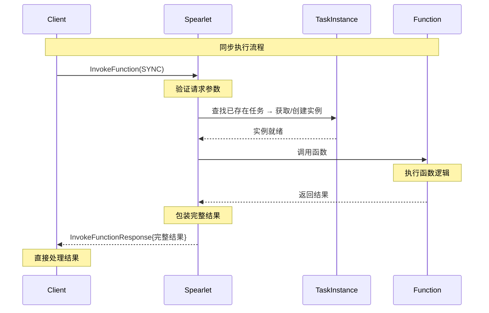
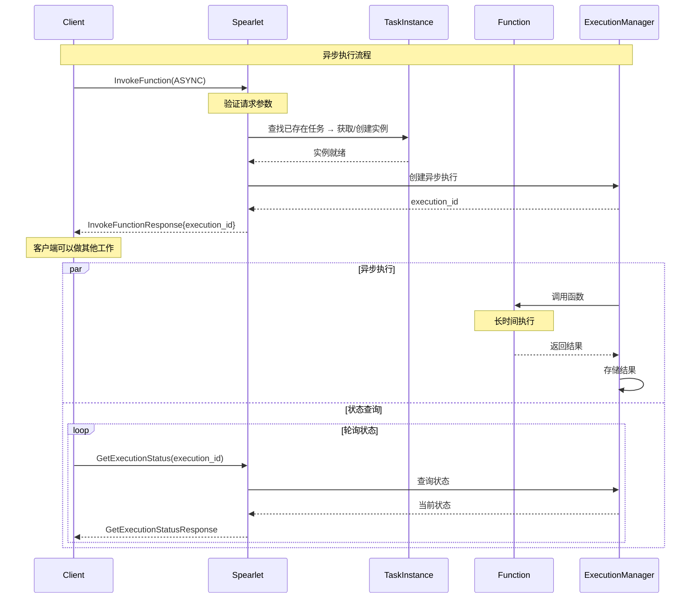

# Sync vs Async 函数调用模式对比

## 概述

本文档详细说明了 Spearlet `InvokeFunction` 接口中同步（SYNC）和异步（ASYNC）执行模式的具体区别、使用场景和实现细节。

## 核心区别对比

### 1. 执行流程对比

| 特性 | SYNC 同步模式 | ASYNC 异步模式 |
|------|--------------|---------------|
| **调用方式** | 阻塞调用 | 非阻塞调用 |
| **返回时机** | 函数执行完成后返回 | 立即返回执行标识 |
| **结果获取** | 直接在响应中包含结果 | 需要通过 GetExecutionStatus 查询 |
| **连接保持** | 需要保持连接直到完成 | 可以断开连接后查询 |
| **适用场景** | 快速执行的函数 | 长时间运行的任务 |

### 2. 请求参数对比

#### 同步模式请求
```protobuf
InvokeFunctionRequest {
  invocation_type = INVOCATION_TYPE_EXISTING_TASK;
  execution_mode = EXECUTION_MODE_SYNC;  // 🔑 关键：同步模式
  task_id = "existing-task-123";        // 🔑 调用已存在任务
  function_name = "quick_calculation";
  parameters = [
    { name = "input", value = "123" }
  ];
  context = {
    timeout_ms = 5000;  // 5秒超时
    max_retries = 0;    // 同步模式通常不重试
  };
}
```

#### 异步模式请求
```protobuf
InvokeFunctionRequest {
  invocation_type = INVOCATION_TYPE_EXISTING_TASK;
  execution_mode = EXECUTION_MODE_ASYNC;  // 🔑 关键：异步模式
  task_id = "existing-task-124";         // 🔑 调用已存在任务
  function_name = "process";
  parameters = [
    { name = "dataset", value = "large_data.csv" }
  ];
  context = {
    timeout_ms = 3600000;  // 1小时超时
    max_retries = 3;       // 异步模式支持重试
  };
}
```

### 3. 响应内容对比

#### 同步模式响应
```protobuf
InvokeFunctionResponse {
  success = true;
  message = "Function executed successfully";
  execution_id = "sync_exec_001";
  task_id = "task_123";
  instance_id = "instance_456";
  
  // 🎯 关键：直接包含完整结果
  result = {
    status = EXECUTION_STATUS_COMPLETED;
    result = {
      type_url = "type.googleapis.com/CalculationResult";
      value = /* 序列化的计算结果 */;
    };
    execution_time_ms = 1500;
    memory_usage_mb = 10;
  };
  
  // 异步相关字段为空
  status_endpoint = "";
  estimated_completion_ms = 0;
}
```

#### 异步模式响应
```protobuf
InvokeFunctionResponse {
  success = true;
  message = "Function execution started";
  execution_id = "async_exec_002";  // 🔑 关键：用于后续查询
  task_id = "task_124";
  instance_id = "instance_457";
  
  // 🎯 关键：结果为初始状态
  result = {
    status = EXECUTION_STATUS_PENDING;  // 等待执行
    result = null;  // 暂无结果
    execution_time_ms = 0;
    start_time = "2024-01-15T10:30:00Z";
  };
  
  // 🔑 异步相关信息
  status_endpoint = "/api/v1/execution/async_exec_002/status";
  estimated_completion_ms = 1800000;  // 预计30分钟完成
}
```

## 详细执行流程

### 同步模式执行流程



### 异步模式执行流程



## 代码实现示例

### 同步模式实现伪代码

```rust
async fn handle_sync_invocation(
    request: &InvokeFunctionRequest
) -> Result<InvokeFunctionResponse> {
    // 1. 获取已存在任务与实例
    let task = execution_manager
        .get_task_by_id(&request.task_id)
        .ok_or("TaskNotFound")?;
    let instance = execution_manager.get_or_create_instance(&task).await?;
    
    // 2. 设置同步执行上下文
    let context = ExecutionContext {
        timeout_ms: request.context.timeout_ms,
        execution_mode: ExecutionMode::Sync,
        // ...
    };
    
    // 3. 直接执行函数（阻塞等待）
    let start_time = Instant::now();
    let execution_result = instance.invoke_function_sync(
        &request.function_name,
        &request.parameters,
        &context,
    ).await?;
    
    // 4. 构造完整响应
    Ok(InvokeFunctionResponse {
        success: true,
        execution_id: generate_execution_id(),
        task_id: instance.task_id.clone(),
        instance_id: instance.instance_id.clone(),
        result: Some(ExecutionResult {
            status: ExecutionStatus::Completed,
            result: Some(execution_result),
            execution_time_ms: start_time.elapsed().as_millis() as i64,
            // ...
        }),
        // 异步字段为空
        status_endpoint: String::new(),
        estimated_completion_ms: 0,
    })
}
```

### 异步模式实现伪代码

```rust
async fn handle_async_invocation(
    request: &InvokeFunctionRequest
) -> Result<InvokeFunctionResponse> {
    // 1. 获取已存在任务与实例
    let task = execution_manager
        .get_task_by_id(&request.task_id)
        .ok_or("TaskNotFound")?;
    let instance = execution_manager.get_or_create_instance(&task).await?;
    
    // 2. 创建异步执行
    let execution_id = generate_execution_id();
    let execution_context = ExecutionContext {
        execution_id: execution_id.clone(),
        timeout_ms: request.context.timeout_ms,
        execution_mode: ExecutionMode::Async,
        // ...
    };
    
    // 3. 启动异步执行（非阻塞）
    let execution_handle = tokio::spawn(async move {
        instance.invoke_function_async(
            &request.function_name,
            &request.parameters,
            &execution_context,
        ).await
    });
    
    // 4. 存储执行句柄
    execution_manager.store_execution(execution_id.clone(), execution_handle);
    
    // 5. 立即返回响应
    Ok(InvokeFunctionResponse {
        success: true,
        execution_id: execution_id.clone(),
        task_id: instance.task_id.clone(),
        instance_id: instance.instance_id.clone(),
        result: Some(ExecutionResult {
            status: ExecutionStatus::Pending,
            result: None,  // 暂无结果
            start_time: current_timestamp(),
            // ...
        }),
        // 异步相关信息
        status_endpoint: format!("/api/v1/execution/{}/status", execution_id),
        estimated_completion_ms: estimate_completion_time(&request),
    })
}
```

## 使用场景对比

### 同步模式适用场景

#### ✅ 推荐使用
- **快速计算任务**：执行时间 < 30秒
- **简单数据处理**：内存占用小，CPU密集型
- **实时响应需求**：需要立即获得结果
- **简单的API调用**：第三方服务调用

#### 📝 示例场景
```protobuf
// 数学计算
InvokeFunction("calculate_fibonacci", SYNC) → 立即返回结果

// 文本处理
InvokeFunction("extract_keywords", SYNC) → 立即返回关键词

// 数据验证
InvokeFunction("validate_email", SYNC) → 立即返回验证结果
```

### 异步模式适用场景

#### ✅ 推荐使用
- **长时间运行任务**：执行时间 > 1分钟
- **大数据处理**：需要处理大量数据
- **机器学习训练**：模型训练和推理
- **文件处理**：大文件上传、转换、压缩

#### 📝 示例场景
```protobuf
// 大数据分析
InvokeFunction("analyze_large_dataset", ASYNC) → 返回execution_id

// AI模型训练
InvokeFunction("train_ml_model", ASYNC) → 返回execution_id

// 视频处理
InvokeFunction("process_video", ASYNC) → 返回execution_id
```

## 错误处理对比

### 同步模式错误处理

```rust
// 同步模式：错误直接在响应中返回
match handle_sync_invocation(request).await {
    Ok(response) => {
        if response.result.status == ExecutionStatus::Failed {
            // 处理执行失败
            handle_execution_error(&response.result.error_message);
        } else {
            // 处理成功结果
            process_result(&response.result.result);
        }
    },
    Err(e) => {
        // 处理调用错误
        handle_invocation_error(e);
    }
}
```

### 异步模式错误处理

```rust
// 异步模式：需要通过状态查询获取错误信息
let response = handle_async_invocation(request).await?;
let execution_id = response.execution_id;

// 轮询状态直到完成或失败
loop {
    let status = get_execution_status(execution_id).await?;
    
    match status.result.status {
        ExecutionStatus::Completed => {
            process_result(&status.result.result);
            break;
        },
        ExecutionStatus::Failed => {
            handle_execution_error(&status.result.error_message);
            break;
        },
        ExecutionStatus::Running | ExecutionStatus::Pending => {
            // 继续等待
            tokio::time::sleep(Duration::from_secs(1)).await;
        },
        _ => {
            // 处理其他状态
            handle_unexpected_status(status.result.status);
            break;
        }
    }
}
```

## 性能考虑

### 同步模式性能特点

#### 优势
- **低延迟**：无额外的状态管理开销
- **简单实现**：代码逻辑简单直接
- **资源效率**：不需要额外的存储和查询机制

#### 劣势
- **连接占用**：长时间占用网络连接
- **超时风险**：容易遇到网络超时
- **并发限制**：阻塞式调用限制并发能力

### 异步模式性能特点

#### 优势
- **高并发**：支持大量并发请求
- **资源弹性**：可以根据负载动态调整
- **容错性强**：支持重试和恢复机制

#### 劣势
- **复杂性**：需要状态管理和查询机制
- **存储开销**：需要存储执行状态和结果
- **延迟增加**：需要额外的查询步骤

## 监控和可观测性

### 同步模式监控指标

```yaml
metrics:
  sync_invocation:
    - execution_time_histogram  # 执行时间分布
    - success_rate             # 成功率
    - timeout_rate             # 超时率
    - concurrent_requests      # 并发请求数
    - memory_usage            # 内存使用量
```

### 异步模式监控指标

```yaml
metrics:
  async_invocation:
    - queue_length            # 执行队列长度
    - pending_executions      # 等待执行数量
    - completion_rate         # 完成率
    - average_wait_time       # 平均等待时间
    - status_query_frequency  # 状态查询频率
```

## 最佳实践建议

### 选择决策树

```
函数执行时间 < 30秒？
├── 是 → 使用 SYNC 模式
└── 否 → 函数是否需要实时反馈？
    ├── 是 → 考虑 STREAM 模式
    └── 否 → 使用 ASYNC 模式
```

### 配置建议

#### 同步模式配置
```toml
[sync_execution]
default_timeout_ms = 30000      # 30秒默认超时
max_concurrent_requests = 100   # 最大并发请求
enable_retries = false          # 禁用重试
```

#### 异步模式配置
```toml
[async_execution]
default_timeout_ms = 3600000    # 1小时默认超时
max_queue_size = 1000          # 最大队列大小
status_retention_hours = 24     # 状态保留24小时
enable_retries = true          # 启用重试
max_retries = 3                # 最大重试次数
```

## 总结

同步和异步模式各有优势，选择合适的模式对于系统性能和用户体验至关重要：

- **同步模式**：适合快速、简单的函数调用，提供即时响应
- **异步模式**：适合长时间运行的任务，提供更好的并发性和资源利用率

在实际应用中，建议根据具体的业务需求和性能要求来选择合适的执行模式。
