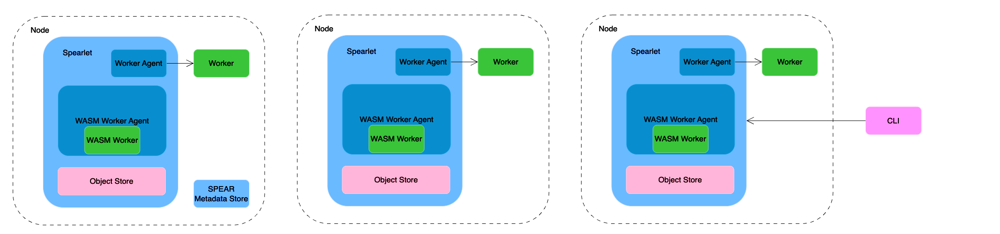
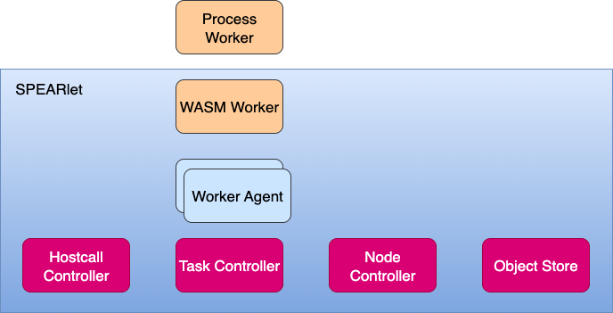
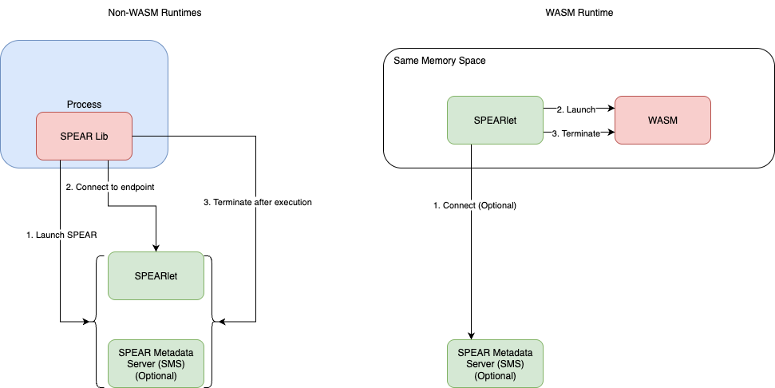
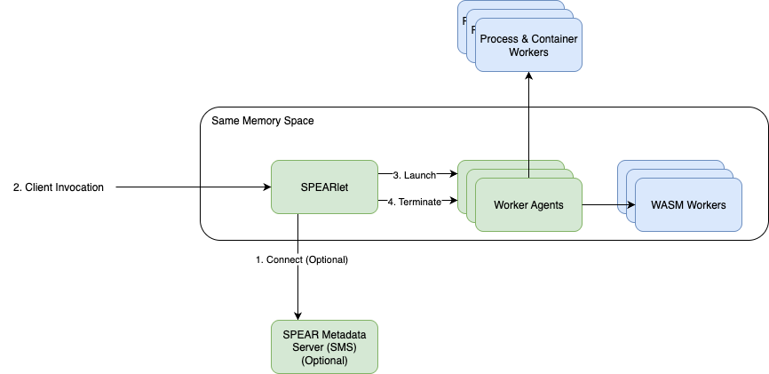
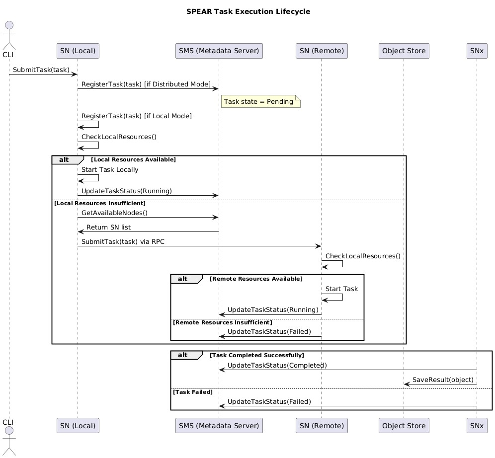

# SPEAR Architecture Documentation

## 1. Architecture Overview

SPEAR is a Serverless runtime platform designed for AI Agents, featuring lightweight, flexible, and multi-runtime support architecture characteristics. The platform focuses on optimizing support for WebAssembly (WASM) while maintaining compatibility with traditional Process runtimes. SPEAR supports both Local and Distributed execution modes, adapting to various deployment scenarios from edge devices to large-scale clusters.

This architecture is particularly suitable for low-latency, short-lived, high-concurrency Agent task execution scenarios, while also meeting the flexible integration needs of multi-language and multi-runtime environments. In the early stages of system design, SPEAR prioritizes runtime lightweight and module decoupling, minimizing strong dependencies on central components (such as Metadata Server) to support unified local and distributed execution models.

### Core Components:
- SPEAR Metadata Server (SMS): Serves as the scheduling and coordination center in distributed mode, responsible for task registration and distribution, Worker lifecycle management, node status aggregation, and resource scheduling.
- SPEARlet: Deployed in each runtime environment (such as VM, container, physical machine), responsible for local task reception, resource allocation, and runtime management. Typically, only one SPEARlet is deployed per physically isolated environment.
- Object Store: Used for sharing input/output objects across nodes, supporting data read/write and isolation through unified APIs.
- SPEAR CLI: Command-line client for developers or upper-layer systems to submit tasks to SPEARlets, manage execution status, and retrieve runtime results. In distributed mode, CLI is one of the main system entry points.

**Note**: SMS and SPEARlet can be deployed on the same node or distributed, depending on the scale and high availability requirements of the scenario.

### Execution Modes:
- Local Mode
  - The system contains only one SPEARlet and does not depend on Metadata Server.
  - Suitable for local development debugging, edge execution, or single-machine task scenarios that do not require cross-node scheduling.
  - Tasks are submitted directly to SPEARlet through CLI or local processes, and SPEARlet loads and executes WASM modules (or other runtimes).

- Distributed Mode
  - Contains one central Metadata Server and multiple SPEARlets, forming a scalable scheduling cluster.
  - CLI or upper-layer systems access through a SPEARlet entry node, with SPEARlet and SMS collaboratively scheduling tasks to appropriate nodes.
  - During task execution, SPEARlet loads corresponding runtimes (such as WASM) for execution, and task input/output is managed through Object Store, achieving data isolation and cross-node transmission.

### System Goals:
SPEAR architecture aims to:
- Provide a universal, efficient, and scalable runtime platform for intelligent Agent workloads;
- Support multiple lightweight runtimes, with WASM as the primary target, and support future extensions such as Python VM, native processes, or container environments;
- Achieve unified execution and scheduling capabilities from edge deployment to central clusters;
- Reduce Agent deployment and operational complexity, improve resource utilization and system elasticity.

## 2. Core Components & Responsibilities

SPEAR architecture consists of multiple loosely coupled core components with local independent operation capabilities while supporting distributed scaling. The main components are as follows:

### 2.1 SPEARlet

SPEARlet is an execution node deployed in each runtime environment that can operate independently or connect to Metadata Server (SMS) to form a distributed cluster:
- **Object Store**  
  Local or remote shared storage component for saving and reading intermediate objects of AI Agents. Supports cross-node access, enabling different nodes to share input/output data. Also supports direct access by locally running Agents, improving data processing efficiency.
- **Worker Agent**  
  Adapter that hosts specific Workloads, responsible for scheduling and isolating different types of Agent execution environments. Each type of Agent uses a corresponding Worker Agent. WASM Workload runs in the same memory space as SPEARlet without inter-process communication, providing extremely high execution efficiency and is SPEAR's preferred runtime.
- **Hostcall Controller**  
  Provides access interfaces to underlying platform capabilities in the runtime environment, supporting AI model invocation, logging, remote communication, and other basic functions. Provides necessary hostcall capability bridging for WASM and other sandbox runtimes.
- **Task Controller**  
  Manages the lifecycle of local Tasks, including reception, scheduling, execution, and termination. Supports cross-node RPC requests from other SPEARlets, enabling remote scheduling and collaboration of distributed tasks.
- **Node Controller**  
  Responsible for periodically reporting the runtime status of this node (health status, load information, etc.) to Metadata Server, supporting resource awareness and health monitoring at the scheduling layer.

### 2.2 SPEAR Metadata Server (SMS)

SMS is the coordination and scheduling hub in distributed mode, responsible for maintaining system metadata, including:
- Node registration information (Node status and resource information);
- Task lifecycle status (submitted, running, completed, etc.);
- Worker Agent metadata;
- Object Store data index.

The ultimate goal of SMS is to be designed as a stateless, horizontally scalable scheduling service. To simplify early development and deployment, it may temporarily adopt stateful implementation based on the selected KV storage engine.

### 2.3 KV DB

All SPEAR metadata is persistently stored by the underlying KV database. The long-term goal is to support strongly consistent distributed KV (such as etcd), and also support local single-node embedded KV (such as BadgerDB) as a testing or local runtime solution. SMS provides state management capabilities externally based on KV storage, decoupling scheduling logic from data persistence.

## 3. Execution Modes (Local vs Distributed)

SPEAR supports two execution modes: Local Mode and Distributed Mode, adapting to development debugging, small-scale edge execution, and multi-node high-concurrency production scenarios respectively.

### 3.1 Local Mode

Local Mode is SPEAR's lightweight execution form, suitable for local development debugging, small single-machine environments, or resource-constrained devices. The system runs only one SPEARlet without depending on Metadata Server (SMS), tasks execute locally, and all metadata is saved in SPEARlet's local memory or local KV.

Execution paths differ for different runtimes:
- For runtimes with independent process models like Process, SPEARlet starts directly as a task execution container, and a local SMS instance can be temporarily enabled when necessary to unify interfaces.
- For WASM runtime, SPEARlet loads WASM modules into its own memory space for execution after startup, requiring no additional containers, providing higher execution efficiency and resource utilization.

**Local Mode Characteristics**:
- No dependency on SMS, no central scheduling logic;
- All tasks execute on local SPEARlet, suitable for local testing or edge scenarios;
- Does not support task distribution and cross-node scheduling;
- All metadata (task status, object data, etc.) is stored only locally.

### 3.2 Distributed Mode

Distributed Mode supports multi-node collaborative execution and is SPEAR's primary execution mode. The system contains one Metadata Server (SMS) and several SPEARlets, suitable for production environments and large-scale Agent task scheduling scenarios.

In this mode:
- All SPEARlets connect to SMS at startup and periodically report their status (resources, load, health status, etc.);
- SMS maintains the topology and metadata of the entire cluster and executes task scheduling logic;
- CLI or upper-layer systems connect to any SPEARlet and submit tasks through RPC;
- The SPEARlet receiving the task request collaborates with SMS to complete scheduling and dispatches tasks to appropriate target SPEARlets;
- Execution nodes select corresponding runtimes and Worker Agents to start based on task types, and read/write task data through Object Store.

**Distributed Mode Characteristics**:
- Supports multi-node, heterogeneous deployment;
- Cluster state managed by SMS, supports unified scheduling and status queries;
- CLI serves as user entry point, initiating task requests through any SPEARlet;
- Supports remote execution, cross-node scheduling, and task disaster recovery;
- Provides horizontal scaling capabilities, suitable for high-concurrency Agent execution scenarios.

## 4. Task Lifecycle (with Sequence Diagram)

SPEAR's task execution lifecycle covers task submission, scheduling, execution, and result persistence, supporting automatic scheduling location decision-making in local or distributed modes. The overall process is as follows:
1. **CLI Task Submission**: Users initiate task requests to a SPEARlet through CLI, calling its exposed RPC interface.
2. **Task Registration**: After receiving the request, SPEARlet registers the task to Metadata Server (SMS) (in distributed mode) or stores it in local memory (Local Mode), and marks the task status as Pending.
3. **Resource Check (Local)**: SPEARlet checks local resource conditions (such as memory, CPU quota, etc.):
   - If local resources are sufficient, directly start the corresponding Task locally and set status to Running;
   - If resources are insufficient, proceed to the next step.
4. **Task Forwarding (Cross-node)**: SPEARlet queries SMS for a list of other available SPEARlets in the current cluster and selects a target node with resources.
5. **Remote Call**: Local SPEARlet uses RPC to request the target SPEARlet to execute the task.
6. **Remote Execution**: Target SPEARlet starts the task and sets status to Running.
7. **Task Completion or Failure**:
   - If execution succeeds, status is set to Completed, and results are written to Object Store;
   - If task fails, status is set to Failed, allowing CLI or system to read failure reasons.

## 5. Scheduling Strategy & Fault Tolerance

SPEAR adopts a lightweight, phased scheduling mechanism that balances local fast response and cluster-level resource scheduling capabilities. The current design focuses on the scalability and concise implementation of core scheduling logic, and will gradually enhance capabilities in high availability and fault recovery in the future.

### 5.1 Scheduling Mechanism

SPEAR's scheduling adopts a **Two-Stage Scheduling** model:
1. **Local First Scheduling**:
   - After receiving a task request, SPEARlet first attempts to execute locally;
   - If the current node has sufficient resources (CPU, memory) and available Workers, execute the task directly.
2. **Global Scheduling (Fallback to Global)**:
   - If local resources are insufficient, SPEARlet requests a list of other available nodes from SMS;
   - Filter appropriate nodes based on task resource requirements (such as CPU cores, memory) and delegate execution.

Task scheduling is matched based on the runtime specifications (Function Spec) of functions or Agents, including:
- Required CPU/memory resources;
- Runtime type (WASM or Process);
- Whether local priority, data affinity, and other strategies are required (reserved for extension).

### 5.2 Worker Lifecycle Management

Worker lifecycle management currently varies by runtime type:
- **WASM Mode**:
  - Worker shares memory space with SPEARlet, lifecycle controlled by SPEARlet process;
  - No heartbeat mechanism used, Worker startup and termination directly managed by SPEARlet.
- **Process Mode**:
  - Worker exists as an independent process;
  - SPEARlet determines liveness by monitoring process status (PID);
  - No additional heartbeat protocol used, simplifying communication overhead.

Future plans include supporting Worker crash auto-restart and Worker Pool mechanisms to improve execution stability.

### 5.3 Task Retry & Fault Tolerance

The current version has not yet implemented automatic task retry mechanisms. The following fault tolerance strategies will be introduced subsequently:
- Automatic task failure retry (with maximum retry count and retry strategy);
- Worker crash detection and task migration;
- Task execution idempotency support to ensure retry safety.

### 5.4 High Availability Planning

In the current phase, Metadata Server (SMS) is a single-point component with Single Point of Failure (SPOF) issues.  
Future plans include:
- Designing SMS as a **stateless service**, externalizing all metadata to strongly consistent KV storage (such as etcd);
- Supporting horizontal scaling of multiple SMS instances with data synchronization through consistent KV;
- Introducing health detection and Leader election mechanisms to eliminate single-point dependencies.

## 6. Object Store Design

SPEAR's Object Store is a lightweight shared object management module integrated into each SPEARlet, designed specifically for efficient input/output and concurrent access of AI Agent tasks.

### 6.1 Architecture Design

- Object Store is an embedded module in SPEARlet, sharing memory resources with the runtime, avoiding additional inter-process communication overhead.
- In WASM Runtime, Agent and Object Store are located in the same memory space and can read/write directly without sharing memory through mmap and other mechanisms.
- The current version (1.0) temporarily does not support providing cross-process mmap mechanisms for Process-type runtimes, this feature is expected to be introduced in future versions.

### 6.2 Interface Definition

Object Store provides the following basic operation interfaces for object storage, lifecycle management, and concurrency control:
- `PutObject(key, value)`: Write or overwrite object content.
- `GetObject(key)`: Read the content of a specified object.
- `ListObject(prefix)`: List all objects under a specified prefix for debugging or batch operations.
- `AddObjectRef(key)`: Increase reference count to prevent premature object reclamation.
- `RemoveObjectRef(key)`: Decrease reference count for lifecycle management.
- `PinObject(key)`: Mark object as resident, disabling automatic reclamation mechanism.
- `UnpinObject(key)`: Cancel resident marking, restore to normal reclamation status.

The current version supports object overwriting (mutable object model) rather than traditional immutable-only design to improve resource utilization and flexibility.

### 6.3 Concurrent Access Strategy

To handle concurrent read/write, Object Store implements basic concurrency control mechanisms:
- Uses Optimistic Concurrency Control (OCC) to avoid write conflicts:
  - Conflict detection through version numbers or hashes in write operations;
  - If data is detected to have been modified by other tasks, write fails, and upper-layer logic is responsible for retry or exception handling.
- The current version does not yet support MVCC (Multi-Version Concurrency Control), planned for introduction in future versions to support stronger data consistency semantics and concurrent access capabilities.

### 6.4 Future Evolution Direction

- Introduce MVCC support, allowing multiple versions under the same Object Key to improve read/write isolation;
- Support mmap data sharing mechanisms for Process-type runtimes;
- Enhance object metadata management (such as timestamps, versions, lifecycle markers, etc.);
- Introduce transactional object operation interfaces supporting batch write and rollback.

## 7. Deployment & Observability (CLI/API/Logs/Monitoring)

SPEAR provides a set of basic capabilities in development and observability to support task debugging, runtime status tracking, log queries, and other development and operational scenarios. The current phase focuses on CLI tools and log management, with gradual expansion to a complete observability and debugging framework in the future.

### 7.1 Development Tools (CLI & API)

In version 1.0, SPEAR provides a lightweight command-line tool (SPEAR CLI) as the main development and scheduling entry point, supporting the following functions:
- Submit tasks (local/cluster)
- Query task status and metadata
- View node resources and runtime status
- Retrieve runtime logs
- Stop or destroy tasks

CLI communicates with SPEARlet through gRPC protocol, facilitating future integration as a unified API gateway or control plane system (such as Dashboard or platform entry).

### 7.2 Logging System

Logging is the main observability method in the current version, divided into the following two categories:
- **System Logs**: Include runtime logs of SPEARlet and Metadata Server (SMS), resource reports, RPC calls, and other system events;
- **Task Logs**: Record standard output, error output, and other debugging information for each running task (especially WASM Agents).

Logs are stored by default in the local file system, divided by node and task for later review and script analysis.

#### WASM Log Collection Mechanism

WASM tasks run in a space sharing memory with SPEARlet, so their logs are not output through traditional stdout/stderr, but are captured and uniformly managed by SPEAR's internal log channels, achieving a balance between performance and isolation.

### 7.3 Future Observability Plans

To support large-scale deployment and online operability, subsequent versions of SPEAR will gradually enhance the observability system, including:
- Centralized log support: Output to ElasticSearch, Loki, FluentBit, and other systems, supporting search, aggregation, and visualization;
- Distributed tracing: Integrate OpenTelemetry or similar frameworks to achieve end-to-end call chain recording for tasks;
- Exception event collection: Unified reporting of task failures, scheduling exceptions, node fluctuations, and other key events, supporting alerting and metric integration;
- System dashboard/control panel: Provide Web UI or Dashboard, integrating task management, status monitoring, and log query functions.

## 8. Extensibility & Version Compatibility

SPEAR emphasizes module decoupling and standardized interfaces in architectural design to support continuous expansion of future multi-type runtimes and plugin ecosystems. Version 1.0 focuses on core functionality stability and usability but has laid the foundation for future extensibility and version compatibility in design.

### 8.1 Worker Agent Standardization & Version Control

Each type of task runtime is handled by corresponding Worker Agents for loading and scheduling. To support the evolution path of multi-language, multi-runtime coexistence, subsequent versions will:
- Standardize Worker Agent interface standards: Unify key interfaces such as task description, execution lifecycle, and resource models to ensure replaceability and composability between different implementations;
- Introduce interface version control mechanisms: Support backward compatibility, avoiding compatibility issues caused by runtime dependency upgrades;
- Support feature negotiation and detection based on interface capabilities: Facilitate CLI or platforms to dynamically match tasks and runtimes based on Agent capabilities.

### 8.2 WASM Plugin Mechanism (Planned)

Future versions will introduce WASM plugin mechanisms to achieve plugin-style expansion of Worker Agents. Core goals include:
- Allow users to encapsulate custom capabilities (such as model loading, data preprocessing, calling external APIs, etc.) as hot-pluggable WASM modules;
- Provide plugin lifecycle and dependency management interfaces for dynamic composition at runtime;
- Lower the development threshold for new types of Agent capabilities, accelerating custom Agent type implementation;
- Maintain decoupling between core SPEARlet and plugins, improving main system stability and maintainability.

## 9. Example Use Case & Developer Flow (Planned in Post-1.0)

SPEAR version 1.0 focuses on architecture construction and closed-loop verification of core execution paths. Typical application scenarios and developer usage flows will be gradually completed in subsequent versions.

Future provisions will include:
- Agent development examples under different Runtimes (such as WASM/Process)
- Task description format and CLI submission process
- Log, output, and debugging process instructions

This content will be officially released after SDK and Developer Guide maturity.

## 10. Roadmap & Future Extensions

This section clarifies SPEAR 1.0's delivery goals and subsequent evolution directions, ensuring the platform has operational basic capabilities while reserving design space for future feature expansion.

### 10.1 SPEAR 1.0 Goals

#### Runtime Support
- Implement WASM and Process runtime environments;
- WASM runtime shares memory space with SPEARlet, providing lightweight and efficient scheduling execution capabilities;
- Basic Hostcall capabilities, including Streaming interaction interfaces.

#### Task Scheduling Mechanism
- Implement two-tier scheduling logic: local priority, global scheduling when resources are insufficient;
- Provide basic Task lifecycle management and resource evaluation mechanisms.

#### Object Storage System
- Embedded Object Store supporting object Put/Get/Ref management;
- Concurrent access using optimistic concurrency control;
- No MVCC implementation, allowing object overwriting, simplifying design.

#### CLI Tools & Development Interfaces
- Provide basic CLI tools for task submission, status queries, and result downloads;
- Support integration with upper-layer systems through gRPC;
- Unified log output management to local files (including system logs and WASM task logs).

#### System Operations Capabilities
- SPEARlet node status reporting (Node Controller);
- Support distributed mode deployment of SMS and multiple SPEARlets;
- Initial version SMS as central coordination point, high availability not yet implemented.

### 10.2 Post-1.0 Evolution Directions

#### Runtime & Scheduling Capability Expansion
- Add container-type Runtime (such as Docker);
- Support task failure retry, timeout detection, task priority scheduling;
- Introduce Function scheduling strategies based on resource constraints.

#### Advanced Feature Support
- Workflow/DAG task execution;
- Extend Hostcall support such as Agent Federation, RAG integration;
- Multi-node/multi-region collaborative execution.

#### Observability & Development Experience Enhancement
- Distributed Tracing integration (such as OpenTelemetry);
- Integration with logging systems (ES/Loki), supporting structured task event collection;
- CLI and SDK enhancement, supporting debugging, template reuse, Dev Flow standardization.