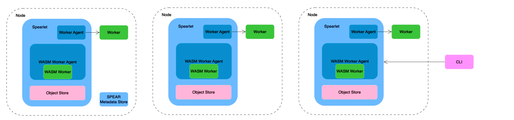
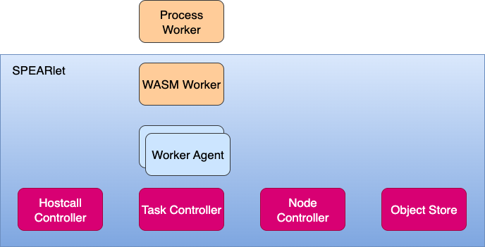
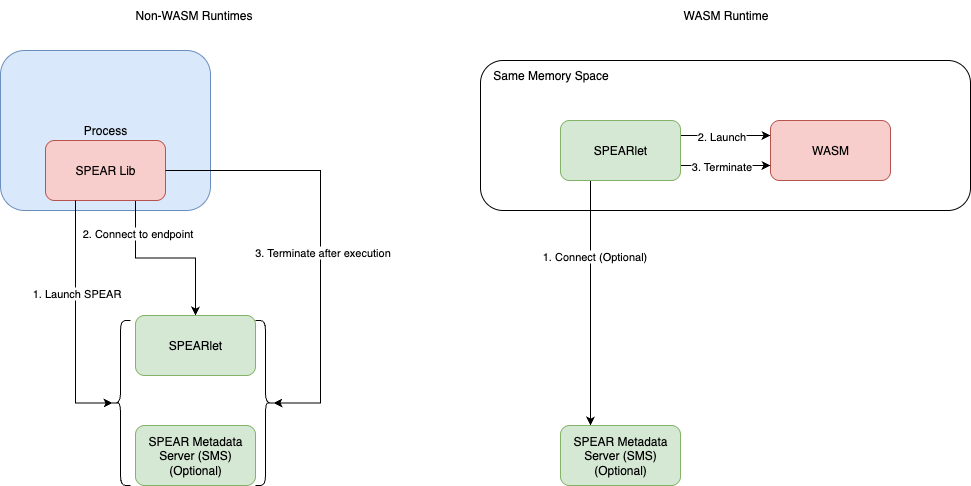
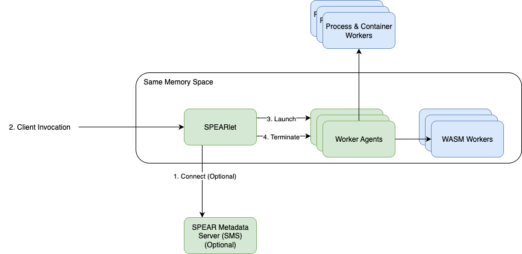
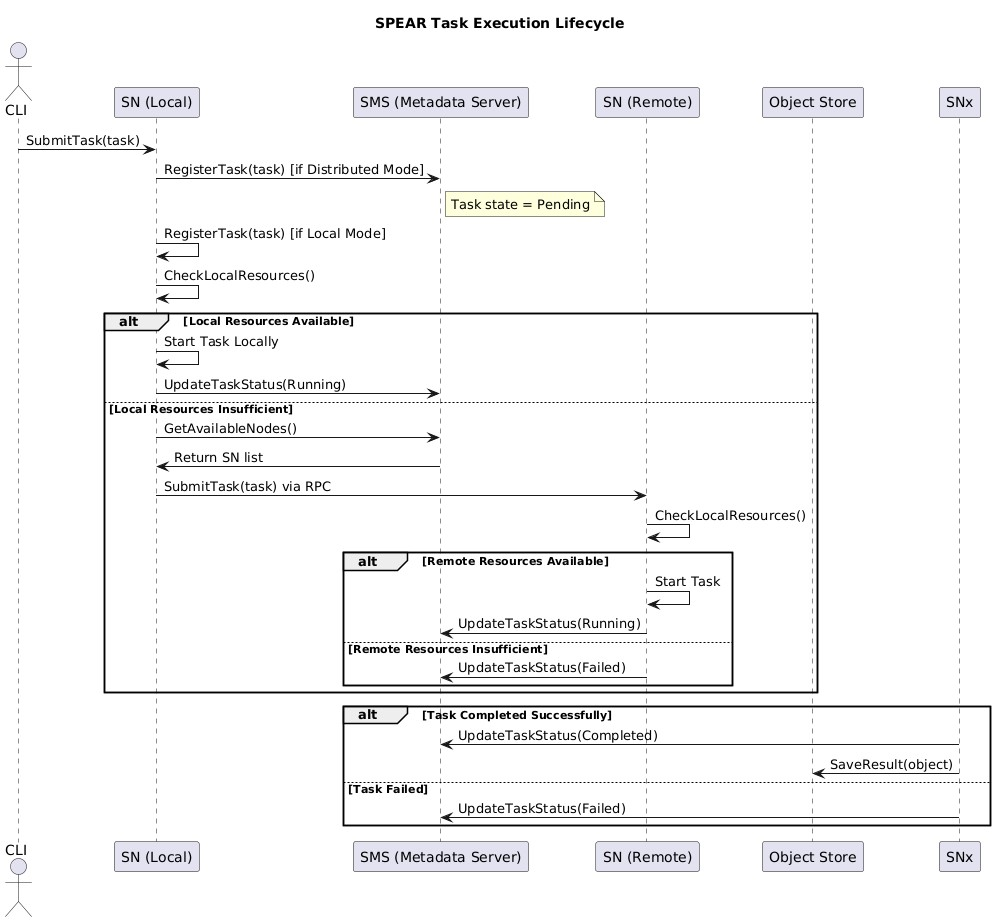

# SPEAR 架构文档

## 1. Architecture Overview

SPEAR 是一个面向 AI Agent 的 Serverless 运行平台，具备轻量、灵活和多运行时支持的架构特性。平台重点优化了对 WebAssembly（WASM）的支持，同时兼容传统 Process 运行时。SPEAR 支持本地（Local）和分布式（Distributed）两种运行模式，适配从边缘设备到大规模集群的多种部署形态。

该架构特别适用于低延迟、短生命周期、高并发的 Agent 任务执行场景，同时也满足多语言、多运行时的灵活集成需求。在系统设计早期阶段，SPEAR 优先保证运行时的轻量性与模块解耦，尽量减少对中心组件（如 Metadata Server）的强依赖，以支持统一的本地和分布式运行模型。

### 核心组件：
- SPEAR Metadata Server（SMS）：作为分布式模式下的调度与协调中心，负责任务注册与分发、Worker 生命周期管理、节点状态汇总与资源调度。
- SPEARlet：部署于每个运行环境中（如 VM、容器、物理机），负责本地任务接收、资源分配和运行时管理。每个物理隔离环境中通常只部署一个 SPEARlet。
- Object Store：用于跨节点共享输入输出对象（object），支持通过统一 API 进行数据读写与隔离。
- SPEAR CLI：命令行客户端，供开发者或系统上层使用，用于向某个 SPEARlet 提交任务、管理执行状态并获取运行结果。在分布式模式中，CLI 是系统的主要入口之一。

**注**：SMS 与 SPEARlet 可部署在同一节点，也可分布式部署，具体依场景的规模与高可用性需求而定。

### 运行模式：
- Local Mode
  - 系统中仅包含一个 SPEARlet，不依赖 Metadata Server。
  - 适用于本地开发调试、边缘运行、或不需要跨节点调度的单机任务场景。
  - 任务通过 CLI 或本地流程直接提交至 SPEARlet，SPEARlet 加载并执行 WASM 模块（或其他运行时）。

- Distributed Mode
  - 包含一个中心 Metadata Server 与多个 SPEARlet，组成一个可扩展的调度集群。
  - CLI 或上层系统通过某个 SPEARlet 入口节点接入，由 SPEARlet 与 SMS 协同调度任务至合适节点。
  - 任务执行过程中，SPEARlet 加载相应运行时（如 WASM）进行执行，任务输入输出通过 Object Store 管理，实现数据隔离与跨节点传输。

### 系统目标：
SPEAR 架构旨在：
- 提供通用、高效、可扩展的运行平台，面向智能 Agent 运行负载；
- 支持多种轻量运行时，以 WASM 为首要目标，并支持后续扩展如 Python VM、原生进程或容器环境；
- 实现从边缘部署到中心集群的统一运行与调度能力；
- 降低 Agent 的部署与运维复杂度，提高资源利用率与系统弹性。

## 2. Core Components & Responsibilities

SPEAR 架构由多个松耦合的核心组件组成，具备本地独立运行能力，同时支持分布式扩展。主要组件如下：

### 2.1 SPEARlet

SPEARlet 是部署在每个运行环境中的执行节点，可独立运行，也可连接至 Metadata Server（SMS）组成分布式集群：
- **Object Store**  
  本地或远程共享存储组件，用于保存和读取 AI Agent 的中间对象（object）。支持跨节点访问，使不同节点之间能够共享输入输出数据。也支持本地运行的 Agent 直接访问，提升数据处理效率。
- **Worker Agent**  
  承载具体 Workload 的适配器，负责调度和隔离不同类型的 Agent 执行环境。每类 Agent 使用对应类型的 Worker Agent。WASM Workload 与 SPEARlet 运行在同一内存空间，无需进程间通信，具备极高执行效率，是 SPEAR 的首选运行时。
- **Hostcall Controller**  
  提供运行时环境中对底层平台能力的访问接口，支持 AI 模型调用、日志记录、远程通信等基础功能。为 WASM 等沙盒运行时提供必要的宿主调用（hostcall）能力桥接。
- **Task Controller**  
  管理本地 Task 的生命周期，包括接收、调度、执行与终止。支持来自其他 SPEARlet 的跨节点 RPC 请求，实现分布式任务的远程调度与协同。
- **Node Controller**  
  负责将本节点的运行状态（健康状况、负载信息等）周期性上报给 Metadata Server，支撑调度层的资源感知与健康监控。

### 2.2 SPEAR Metadata Server（SMS）

SMS 是分布式模式下的协调与调度中枢，负责维护系统的元信息，包括：
- 节点注册信息（Node 状态与资源信息）；
- 任务生命周期状态（已提交、运行中、完成等）；
- Worker Agent 元信息；
- Object Store 数据索引。

SMS 的最终目标是设计为无状态、可水平扩展的调度服务。为了简化早期开发与部署，可根据所选 KV 存储引擎临时采用有状态实现。

### 2.3 KV DB

SPEAR 所有元数据由底层 KV 数据库持久化存储。长期目标是支持强一致性的分布式 KV（如 etcd），也支持本地单节点嵌入式 KV（如 BadgerDB）作为测试或本地运行方案。SMS 基于 KV 存储对外提供状态管理能力，将调度逻辑与数据持久性解耦。

## 3. Execution Modes (Local vs Distributed)

SPEAR 支持两种运行模式：本地模式（Local Mode）和分布式模式（Distributed Mode），分别适配开发调试、小规模边缘运行以及多节点高并发的生产场景。

### 3.1 Local Mode

Local Mode 是 SPEAR 的轻量运行形态，适用于本地开发调试、小型单机环境或资源受限设备。系统中只运行一个 SPEARlet，不依赖 Metadata Server（SMS），任务在本地执行，所有元信息保存在 SPEARlet 本地内存或本地 KV 中。

不同运行时的执行路径有所差异：
- 对于 Process 等具有独立进程模型的运行时，SPEARlet 启动后直接作为任务执行容器，必要时可临时启用一个本地 SMS 实例以统一接口。
- 对于 WASM 运行时，SPEARlet 启动后将 WASM 模块加载到自身内存空间中执行，无需额外容器，具有更高执行效率和资源利用率。

**Local Mode 特点**：
- 无需依赖 SMS，无中心调度逻辑；
- 所有任务在本地 SPEARlet 执行，适合本地测试或边缘场景；
- 不支持任务分发与跨节点调度；
- 所有元数据（任务状态、对象数据等）仅存储于本地。

### 3.2 Distributed Mode

Distributed Mode 支持多节点协同执行，是 SPEAR 的主要运行模式。系统中包含一个 Metadata Server（SMS）以及若干个 SPEARlet，适合生产环境、大规模 Agent 任务调度场景。

在该模式下：
- 所有 SPEARlet 会在启动时连接 SMS，定期上报自身状态（资源、负载、健康状况等）；
- SMS 维护整个集群的拓扑与元信息，并执行任务调度逻辑；
- CLI 或上层系统连接到任意一个 SPEARlet，通过 RPC 提交任务；
- 接收到任务请求的 SPEARlet 与 SMS 协同完成调度，并将任务派发至适合的目标 SPEARlet；
- 执行节点根据任务类型选择对应的运行时与 Worker Agent 启动，并通过 Object Store 读写任务数据。

**Distributed Mode 特点**：
- 支持多节点、异构部署；
- 集群状态由 SMS 管理，支持统一调度与状态查询；
- CLI 作为用户入口，通过任意 SPEARlet 发起任务请求；
- 支持远程执行、跨节点调度与任务容灾；
- 提供水平扩展能力，适合高并发 Agent 执行场景。

## 4. Task Lifecycle (with Sequence Diagram)

SPEAR 的任务执行生命周期涵盖任务的提交、调度、执行与结果持久化，支持在本地或分布式模式下自动决策调度位置。整体流程如下：
1. **CLI 提交任务**：用户通过 CLI 向某个 SPEARlet发起任务请求，调用其暴露的 RPC 接口。
2. **任务注册**：SPEARlet 接收到请求后，将任务注册到 Metadata Server（SMS）中（在分布式模式），或存入本地内存（Local Mode），并将任务状态标记为 Pending。
3. **资源检查（本地）**：SPEARlet 检查本地资源情况（如内存、CPU 配额等）：
   - 若本地资源充足，则直接在本地启动对应 Task，状态设为 Running；
   - 若资源不足，转向下一步。
4. **任务转发（跨节点）**：SPEARlet 向 SMS 查询当前集群中其他可用 SPEARlet 列表，选择一个具备资源的目标节点。
5. **远程调用**：本地 SPEARlet 使用 RPC 向目标 SPEARlet 请求执行该任务。
6. **远程执行**：目标 SPEARlet 启动任务并设置状态为 Running。
7. **任务完成或失败**：
   - 若执行成功，状态设为 Completed，并将结果写入 Object Store；
   - 若任务失败，状态设为 Failed，可供 CLI 或系统读取失败原因。

## 5. Scheduling Strategy & Fault Tolerance

SPEAR 采用轻量化、分阶段的调度机制，兼顾局部快速响应和集群级资源调度能力。当前设计聚焦于核心调度逻辑的可扩展性与简洁实现，未来将逐步增强在高可用性与容错恢复方面的能力。

### 5.1 调度机制

SPEAR 的调度采用 **双层调度（Two-Stage Scheduling）** 模型：
1. **本地优先调度（Local First）**：
   - SPEARlet 在收到任务请求后，优先尝试在本地执行；
   - 若当前节点有足够资源（CPU、内存）且存在可用 Worker，则直接执行任务。
2. **全局调度（Fallback to Global）**：
   - 若本地资源不足，SPEARlet 会向 SMS 请求其他可用节点列表；
   - 根据任务的资源需求（如 CPU 核数、内存）筛选合适节点，委托执行。

任务调度依据函数或 Agent 的运行时规格（Function Spec）进行匹配，包括：
- 所需 CPU/内存资源；
- 所属 Runtime 类型（WASM 或 Process）；
- 是否要求本地优先、数据亲和等策略（预留扩展位）。

### 5.2 Worker 生命周期管理

Worker 生命周期的管理目前依运行时类型而异：
- **WASM 模式**：
  - Worker 与 SPEARlet 共享内存空间，生命周期由 SPEARlet 进程控制；
  - 不使用心跳机制，Worker 启动和终止均由 SPEARlet 直接管理。
- **Process 模式**：
  - Worker 作为独立进程存在；
  - SPEARlet 通过监控进程状态（PID）判断存活情况；
  - 不采用额外心跳协议，简化通信开销。

未来计划支持 Worker 崩溃自动重启与 Worker Pool 机制，以提升执行稳定性。

### 5.3 任务重试与容错

当前版本暂未实现任务自动重试机制。后续将引入以下容错策略：
- 任务失败自动重试（带上最大重试次数与重试策略）；
- Worker 崩溃检测与任务迁移；
- 任务执行幂等性支持，保障重试安全性。

### 5.4 高可用性规划

当前阶段，Metadata Server（SMS）为单点组件，存在单点故障（SPOF）问题。  
未来规划如下：
- 将 SMS 设计为 **无状态服务**，将所有元信息外置至强一致的 KV 存储（如 etcd）；
- 支持多 SMS 实例水平扩展，通过一致性 KV 实现数据同步；
- 引入健康探测与 Leader 选举机制，消除单点依赖。

## 6. Object Store Design

SPEAR 的 Object Store 是集成于每个 SPEARlet中的轻量级共享对象管理模块，专为 AI Agent 任务的高效输入输出和并发访问设计。

### 6.1 架构设计

- Object Store 为 SPEARlet 内嵌模块，与运行时共享内存资源，避免引入额外的进程间通信开销。
- 在 WASM Runtime 中，Agent 与 Object Store 位于同一内存空间，可直接读写，无需通过 mmap 等机制共享内存。
- 当前版本（1.0）暂不支持为 Process 类型的运行时提供跨进程 mmap 机制，该功能预计在未来版本引入。

### 6.2 接口定义

Object Store 提供以下基础操作接口，用于对象的存储、生命周期管理和并发控制：
- `PutObject(key, value)`：写入或覆盖对象内容。
- `GetObject(key)`：读取指定对象的内容。
- `ListObject(prefix)`：列出指定前缀下的所有对象，用于调试或批量操作。
- `AddObjectRef(key)`：增加引用计数，防止对象被提前回收。
- `RemoveObjectRef(key)`：减少引用计数，用于生命周期管理。
- `PinObject(key)`：将对象标记为常驻，禁用自动回收机制。
- `UnpinObject(key)`：取消常驻标记，恢复为正常回收状态。

当前版本支持对象的覆盖（mutable object model），而非传统的 immutable-only 设计，以提高资源利用率和灵活性。

### 6.3 并发访问策略

为处理并发读写，Object Store 实现基本的并发控制机制：
- 使用乐观并发控制（Optimistic Concurrency Control, OCC）来避免写入冲突：
  - 在写入操作中通过版本号或哈希进行冲突检测；
  - 如果检测到数据已被其他任务修改，则写入失败，由上层逻辑负责重试或处理异常。
- 当前版本尚未支持 MVCC（多版本并发控制），计划在未来版本中引入，以支持更强的数据一致性语义和并发访问能力。

### 6.4 未来演进方向

- 引入 MVCC 支持，允许同一 Object Key 下存在多个版本，提升读写隔离性；
- 支持 Process 类型运行时的 mmap 数据共享机制；
- 加强对象元信息管理（如时间戳、版本、生命周期标记等）；
- 引入事务式对象操作接口，支持批量写入与回滚。

## 7. Deployment & Observability (CLI/API/Logs/Monitoring)

SPEAR 在开发与可观测性层面提供一套基础能力，用于支持任务调试、运行状态追踪、日志查询等开发与运维场景。当前阶段以 CLI 工具与日志管理为主，后续将逐步扩展为完整的可观测性与调试框架。

### 7.1 开发工具（CLI & API）

在 v1.0 版本中，SPEAR 提供一个轻量级命令行工具（SPEAR CLI），作为主要的开发与调度入口，支持以下功能：
- 提交任务（本地 / 集群）
- 查询任务状态与元信息
- 查看节点资源与运行状态
- 获取运行日志
- 停止或销毁任务

CLI 通过 gRPC 协议 与 SPEARlet 通信，便于未来集成为统一 API 网关或控制面系统（如 Dashboard 或平台入口）。

### 7.2 日志系统

日志是当前版本主要的可观测手段，分为以下两类：
- **系统日志**：包含 SPEARlet与 Metadata Server（SMS）的运行日志、资源报告、RPC 调用等系统事件；
- **任务日志**：记录每个运行中任务（尤其是 WASM Agent）的标准输出、错误输出等调试信息。

日志默认存储于本地文件系统，按节点与任务划分，便于后期查阅和脚本分析。

#### WASM 日志采集机制

WASM 任务运行在与 SPEARlet 共享内存的空间中，因此其日志不会通过传统 stdout/stderr 输出，而是由 SPEAR 内部日志通道捕获并统一管理，实现性能与隔离的平衡。

### 7.3 可观测性未来计划

为了支持大规模部署与在线可运维，SPEAR 后续版本将逐步增强 observability 体系，包括：
- 集中式日志支持：输出至 ElasticSearch、Loki、FluentBit 等系统，支持检索、聚合与可视化；
- 分布式链路追踪（Tracing）：集成 OpenTelemetry 或类似框架，实现任务的端到端调用链记录；
- 异常事件采集：统一上报任务失败、调度异常、节点波动等关键事件，支持报警与指标集成；
- 系统仪表盘 / 控制面板：提供 Web UI 或 Dashboard，整合任务管理、状态监控与日志查询功能。

## 8. Extensibility & Version Compatibility

SPEAR 在架构设计上强调模块解耦与标准化接口，以支持未来多类型运行时与插件生态的持续扩展。1.0 版本聚焦核心功能的稳定与可用性，但在设计上已为未来的扩展性与版本兼容打下基础。

### 8.1 Worker Agent 标准化与版本控制

每类任务运行时由相应的 Worker Agent 负责加载与调度。为支持多语言、多运行时并存的演化路径，后续版本将：
- 规范 Worker Agent 接口标准：统一任务描述、执行生命周期、资源模型等关键接口，确保不同实现之间可替换、可组合；
- 引入接口版本控制机制：支持向后兼容，避免运行时依赖升级带来的兼容性问题；
- 支持基于接口能力的特性协商与探测：便于 CLI 或平台根据 Agent 能力动态匹配任务与运行时。

### 8.2 WASM 插件机制（计划中）

未来版本将引入 WASM 插件化机制，实现 Worker Agent 的插件式拓展。核心目标包括：
- 允许用户将自定义能力（如模型加载、数据预处理、调用外部 API 等）封装为可热插拔的 WASM 模块；
- 提供插件生命周期与依赖管理接口，实现运行时的动态组合；
- 降低新类型 Agent 能力的开发门槛，加速自定义 Agent 类型落地；
- 保持核心 SPEARlet 与插件解耦，提升主干系统的稳定性与可维护性。

## 9. Example Use Case & Developer Flow (Planned in Post-1.0)

SPEAR 1.0 版本聚焦于架构搭建与核心运行路径的闭环验证。典型应用场景与开发者使用流程将在后续版本逐步补全。

未来将提供:
- 不同 Runtime 下 Agent 编写示例（如 WASM / Process）
- 任务描述格式与 CLI 提交流程
- 日志、输出、调试流程说明

该部分内容将在 SDK 与 Developer Guide 成熟后正式发布。

## 10. Roadmap & Future Extensions

本节明确 SPEAR 1.0 的交付目标与后续演进方向，确保平台在具备可运行基础能力的同时，为未来功能扩展保留设计空间。

### 10.1 SPEAR 1.0 目标

#### Runtime 支持
- 实现 WASM 和 Process 两种运行时环境；
- WASM 运行时与 SPEARlet 共享内存空间，具备轻量高效的调度执行能力；
- 基础的 Hostcall 能力，包括 Streaming 交互接口。

#### 任务调度机制
- 实现双层调度逻辑：本地优先、资源不足时进入全局调度；
- 提供基本的 Task 生命周期管理与资源评估机制。

#### 对象存储系统
- 内嵌式 Object Store，支持对象的 Put / Get / Ref 管理；
- 并发访问采用乐观并发控制；
- 不实现 MVCC，允许对象覆盖，简化设计。

#### CLI 工具与开发接口
- 提供基础 CLI 工具进行任务提交、状态查询、结果下载；
- 支持通过 gRPC 方式对接上层系统；
- 日志输出统一管理到本地文件（包括系统日志与 WASM 任务日志）。

#### 系统运维能力
- SPEARlet 节点状态汇报（Node Controller）；
- 支持分布式模式部署 SMS 与多个 SPEARlet；
- 初始版本 SMS 为中心协调点，尚未实现高可用。

### 10.2 后续版本演进方向（Post-1.0）

#### 运行时与调度能力拓展
- 增加容器类 Runtime（如 Docker）；
- 支持任务的失败重试、超时检测、任务优先级调度；
- 引入基于资源约束的 Function 调度策略。

#### 高级功能支持
- Workflow / DAG 任务执行；
- 扩展 Hostcall 支持如 Agent Federation、RAG 接入；
- 多节点/多区域协同执行。

#### 可观测性与开发体验提升
- 分布式 Tracing 接入（如 OpenTelemetry）；
- 与日志系统（ES / Loki）对接，支持结构化任务事件采集；
- CLI 与 SDK 增强，支持调试、模板复用、Dev Flow 规范化。
