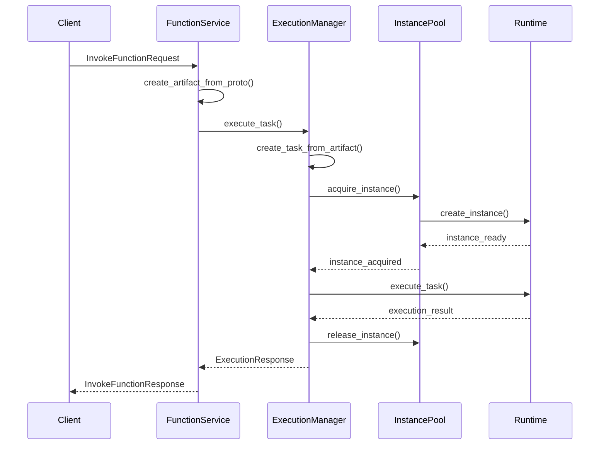
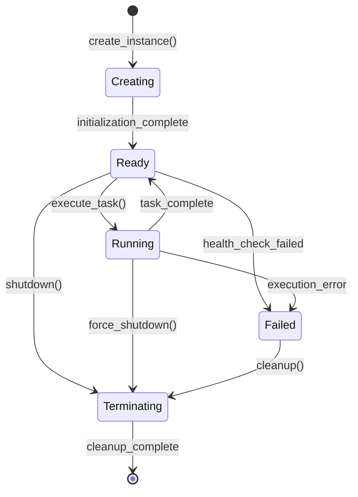

# Artifact-Task-Instance 架构概览

## 架构简介 / Architecture Introduction

Artifact-Task-Instance 架构是 Spear-Next 项目中用于函数执行的核心架构模式。该架构将函数执行过程分解为三个核心概念：

- **Artifact (制品)**: 可执行的代码包，包含运行时配置和元数据
- **Task (任务)**: 基于 Artifact 创建的执行单元，代表一次具体的执行请求
- **Instance (实例)**: 运行时环境实例，负责实际执行 Task

## 核心组件 / Core Components

### 1. Artifact Management / 制品管理

```
src/spearlet/execution/artifact.rs
├── ArtifactSpec          # 制品规范定义
├── Artifact              # 制品实体
├── ArtifactManager       # 制品管理器
└── ArtifactStatus        # 制品状态
```

**主要功能**:
- 制品的创建、存储和版本管理
- 运行时配置和环境变量管理
- 制品依赖关系处理
- 制品生命周期管理

### 2. Task Management / 任务管理

```
src/spearlet/execution/task.rs
├── Task                  # 任务实体
├── TaskSpec              # 任务规范
├── TaskStatus            # 任务状态
└── TaskManager           # 任务管理器
```

**主要功能**:
- 从 Artifact 创建 Task
- 任务状态跟踪和生命周期管理
- 任务参数和上下文处理
- 任务执行结果收集

### 3. Instance Management / 实例管理

```
src/spearlet/execution/instance.rs
├── Instance              # 实例实体
├── InstanceSpec          # 实例规范
├── InstanceStatus        # 实例状态
├── InstancePool          # 实例池
└── InstanceScheduler     # 实例调度器
```

**主要功能**:
- 运行时实例的创建和销毁
- 实例池管理和负载均衡
- 实例健康检查和故障恢复
- 资源限制和隔离

### 4. Execution Management / 执行管理

```
src/spearlet/execution/manager.rs
├── TaskExecutionManager  # 任务执行管理器
├── ExecutionRequest      # 执行请求
├── ExecutionResponse     # 执行响应
├── ExecutionContext      # 执行上下文
└── ExecutionStatistics   # 执行统计
```

**主要功能**:
- 协调 Artifact、Task 和 Instance 的交互
- 执行流程编排和控制
- 错误处理和重试机制
- 性能监控和统计

### 5. Runtime Management / 运行时管理

```
src/spearlet/execution/runtime/
├── mod.rs                # 运行时模块定义
├── manager.rs            # 运行时管理器
├── process.rs            # 进程运行时
├── kubernetes.rs         # Kubernetes 运行时
└── wasm.rs               # WebAssembly 运行时
```

**主要功能**:
- 多种运行时支持 (进程、容器、WASM)
- 运行时生命周期管理
- 资源监控和限制
- 安全隔离和沙箱

## 架构流程 / Architecture Flow

### 1. 函数调用流程



### 2. 实例生命周期



## 配置管理 / Configuration Management

### 1. TaskExecutionManagerConfig

```rust
pub struct TaskExecutionManagerConfig {
    pub max_concurrent_tasks: usize,
    pub task_timeout_ms: u64,
    pub retry_attempts: u32,
    pub enable_metrics: bool,
}
```

### 2. InstancePoolConfig

```rust
pub struct InstancePoolConfig {
    pub min_instances: usize,
    pub max_instances: usize,
    pub idle_timeout_ms: u64,
    pub health_check_interval_ms: u64,
}
```

### 3. RuntimeConfig

```
pub struct RuntimeConfig {
    pub runtime_type: RuntimeType,
    pub settings: HashMap<String, serde_json::Value>,
    pub global_environment: HashMap<String, String>,
    pub spearlet_config: Option<SpearletConfig>,
    pub resource_pool: ResourcePoolConfig,
}
```

运行时通过 `spearlet_config` 读取完整节点配置（例如 `sms_addr`），避免在运行时层读取环境变量。

## 错误处理 / Error Handling

### 错误类型层次

```rust
pub enum ExecutionError {
    // Artifact 相关错误
    ArtifactError(ArtifactError),
    
    // Task 相关错误
    TaskError(TaskError),
    
    // Instance 相关错误
    InstanceError(InstanceError),
    
    // Runtime 相关错误
    RuntimeError(RuntimeError),
    
    // 配置错误
    ConfigurationError(String),
    
    // 系统错误
    SystemError(String),
}
```

### 错误恢复策略

1. **重试机制**: 对于临时性错误，自动重试
2. **降级处理**: 在部分组件故障时提供降级服务
3. **故障隔离**: 防止单个实例故障影响整个系统
4. **快速失败**: 对于不可恢复的错误，快速返回

## 性能优化 / Performance Optimizations

### 1. 实例池优化

- **预热策略**: 提前创建热实例，减少冷启动时间
- **负载均衡**: 智能调度算法，优化资源利用率
- **弹性扩缩**: 根据负载动态调整实例数量

### 2. 内存管理

- **零拷贝**: 在可能的情况下避免数据拷贝
- **对象池**: 复用频繁创建的对象
- **智能缓存**: 缓存热点数据和计算结果

### 3. 并发优化

- **异步执行**: 全异步架构，提高并发能力
- **锁优化**: 使用读写锁和无锁数据结构
- **批处理**: 批量处理相似请求

## 监控和观测 / Monitoring and Observability

### 1. 指标收集

```rust
pub struct ExecutionMetrics {
    pub total_executions: u64,
    pub successful_executions: u64,
    pub failed_executions: u64,
    pub average_execution_time_ms: f64,
    pub active_instances: usize,
    pub queue_length: usize,
}
```

### 2. 日志记录

- **结构化日志**: 使用 tracing 库进行结构化日志记录
- **分级日志**: 支持不同级别的日志输出
- **上下文传播**: 在整个执行链路中传播追踪上下文

### 3. 健康检查

- **组件健康**: 检查各个组件的健康状态
- **资源监控**: 监控 CPU、内存、网络等资源使用
- **性能指标**: 收集和报告性能相关指标

## 扩展性设计 / Scalability Design

### 1. 水平扩展

- **分布式实例池**: 支持跨节点的实例管理
- **负载分片**: 根据负载特征进行智能分片
- **服务发现**: 自动发现和注册服务实例

### 2. 垂直扩展

- **资源动态调整**: 根据负载动态调整资源配置
- **优先级队列**: 支持不同优先级的任务调度
- **资源预留**: 为重要任务预留专用资源

## 安全性考虑 / Security Considerations

### 1. 隔离机制

- **进程隔离**: 不同任务运行在独立进程中
- **容器隔离**: 使用容器技术提供更强的隔离
- **资源限制**: 限制每个任务的资源使用

### 2. 访问控制

- **身份验证**: 验证调用者身份
- **权限控制**: 基于角色的访问控制
- **审计日志**: 记录所有安全相关操作

## 未来发展 / Future Development

### 1. 短期目标

- 完善错误处理和恢复机制
- 优化性能和资源利用率
- 增强监控和观测能力

### 2. 中期目标

- 支持更多运行时类型
- 实现分布式执行能力
- 增加高级调度策略

### 3. 长期目标

- 支持 Serverless 计算模式
- 实现智能资源管理
- 提供图形化管理界面

## 总结 / Summary

Artifact-Task-Instance 架构为 Spear-Next 提供了一个灵活、可扩展、高性能的函数执行框架。通过清晰的职责分离和模块化设计，该架构能够支持多种运行时环境，提供强大的监控和管理能力，并为未来的功能扩展奠定了坚实基础。
